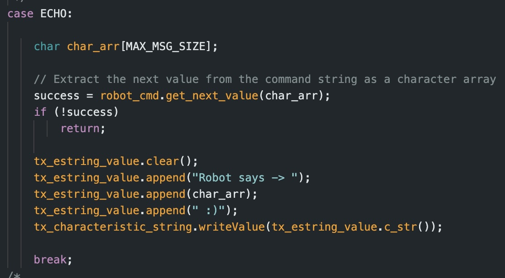
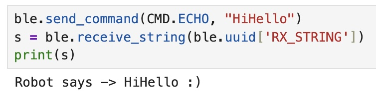
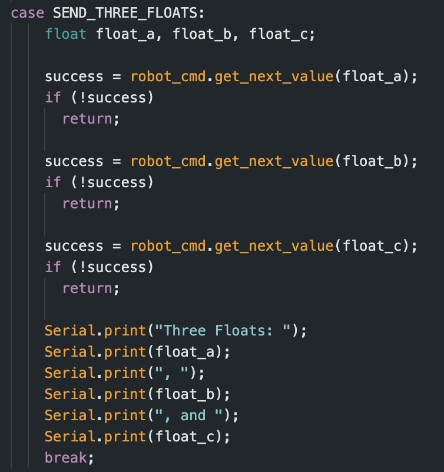
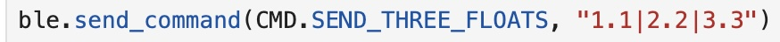
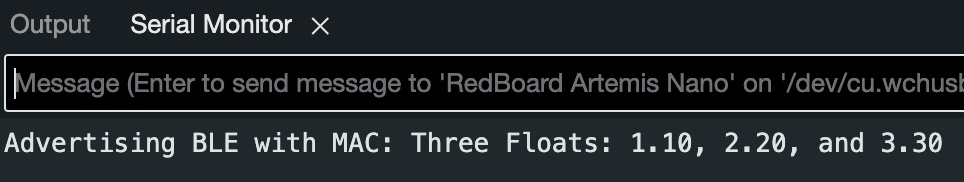
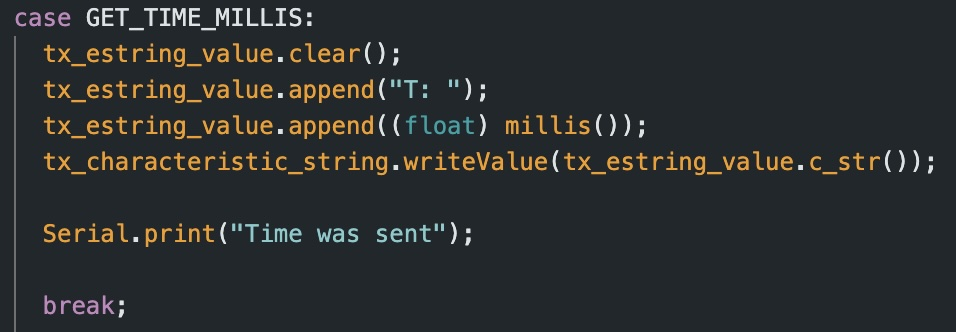
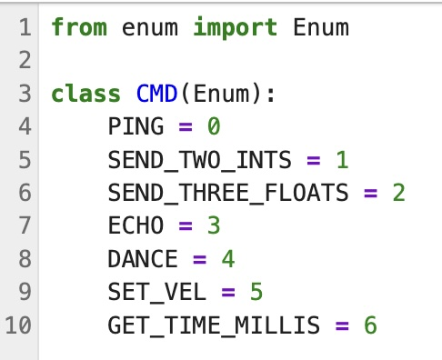
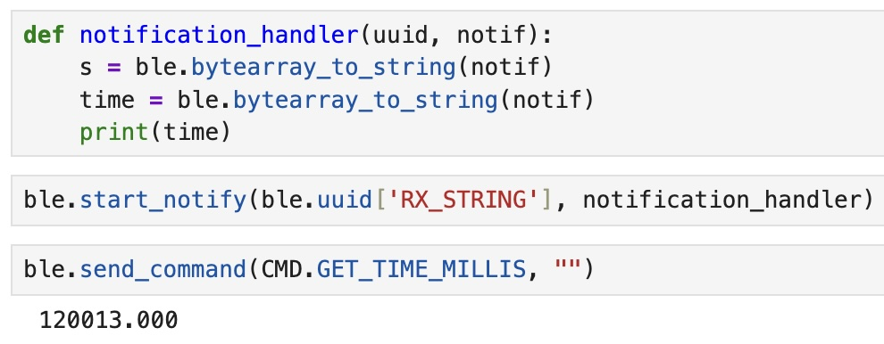

# Lab 1:

## Part A:

### Prelab + Setup
The Prelab and Step 1 consisted of installing the Arduino IDE and following through the preliminary setup instructions to install and calibrate all the necessary components. 

### Lab Tasks

Step 2 was used to test whether the Artemis board was connected properly. To accomplish this, I ran the Example Blink. This caused the LED on the Artemis board to blink on and off which ensured that it was properly connected. 

<iframe width="560" height="315" src="https://www.youtube.com/embed/Ru1aUgjKQpQ?si=NsKYP62ZG1OBjBNK" title="YouTube video player" frameborder="0" allow="accelerometer; autoplay; clipboard-write; encrypted-media; gyroscope; picture-in-picture; web-share" referrerpolicy="strict-origin-when-cross-origin" allowfullscreen></iframe>

Step 3 consisted of following Example4_Serial. This example allowed me to type in a character input and then in turn recieve those same characters as an output in the Serial monitor. 

<iframe width="560" height="315" src="https://www.youtube.com/embed/iJUh5JsOfLU?si=gcEiw02N-yY4jWki" title="YouTube video player" frameborder="0" allow="accelerometer; autoplay; clipboard-write; encrypted-media; gyroscope; picture-in-picture; web-share" referrerpolicy="strict-origin-when-cross-origin" allowfullscreen></iframe>

Step 4 tested the temperature sensor using the Example2_analogRead. As you can see below, pressing on the sensor, effectively warming it up, causes the temperature in the Serial monitor to slowly increase. 

<iframe width="560" height="315" src="https://www.youtube.com/embed/912kibkAclM?si=rgCgDeXAZeq8Y4aF" title="YouTube video player" frameborder="0" allow="accelerometer; autoplay; clipboard-write; encrypted-media; gyroscope; picture-in-picture; web-share" referrerpolicy="strict-origin-when-cross-origin" allowfullscreen></iframe>

I then tested the Artemis board's built in microphone using Example1_MicrophoneOutput. I spoke into the microphone with varying decibels of loudness to see if the microphone would in turn fluctuate at the corresponding frequency.

<iframe width="560" height="315" src="https://www.youtube.com/embed/rot9qSg0sWc?si=e4c_r-u7OsEaiK1v" title="YouTube video player" frameborder="0" allow="accelerometer; autoplay; clipboard-write; encrypted-media; gyroscope; picture-in-picture; web-share" referrerpolicy="strict-origin-when-cross-origin" allowfullscreen></iframe>

## Part B:

### Prelab + Setup

The Prelab and initial steps of this lab consisted of familiarizing myself with BLE, setiting up the virtual environment, and installing the appropriate python packages. Additionally, I modified the UUID and MAC addresses to connect the Artemis board to my laptop.

I used the Artemis address c0:81:a4:22:20:64 and the UUID e81d1925-217b-46e1-8718-ba10e53245d7. To check that the Bluetooth connection was properly established I ran through demo.py and was successful in going through all the code blocks.

### Lab Tasks

#### 1. Echo

The first task was to send a string from the computer to the Artemis and then have it return an augmented verson of the string back to the computer such that it prints out "Robot Says -> ______ :)" . Following the logic used in the PING case, I was able to adapt my code to accomplish the task.

The resulting output from inputting the string "Hello World" can be seen below:

#### 2. Send Three Floats

The second task consisted of writing a command SEND_THREE_FLOATS which sends three floats to the Artemis board and extracts those three values in the Serial monitor. I accomplished this using similar logic to the SEND_TWO_INTS command, adjusting the code to account for three float values instead of int values. 

The resulting output from inputting the series of floats 1.1, 2.2, and 3.3 can be seen below:

#### 3. Get Time Millis

The third task consiste of adding a new command GET_TIME_MILLIS which makes the arduino write a string of the form T:123456 to the string characteristic. To accomplish this, I wrote code using the millis() function in Arduino. Additionally, I had to add the command to the list found in cmd_types.py. 

#### 4. Notification Holder

Task four asked us to setup a notification handler to recieve the string value from the Artemis board and extraxt the time from the string. I accomplished this using the following code:  

#### 5. Data Transfer Rate

#### 6. Send Time Data

#### 7. Get Temperature Readings

#### 8. Data Transfer Rate Discussion
