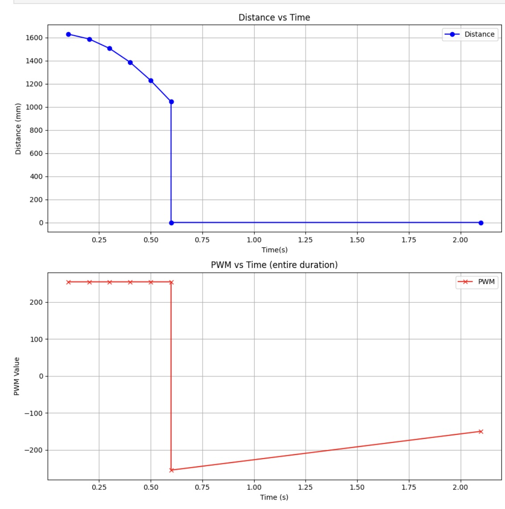
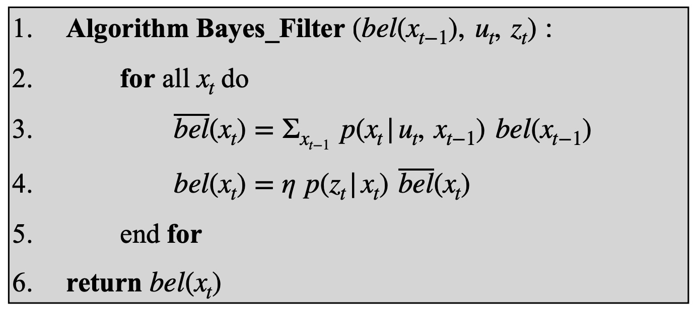
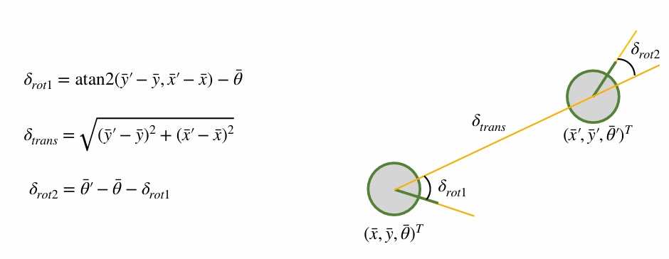
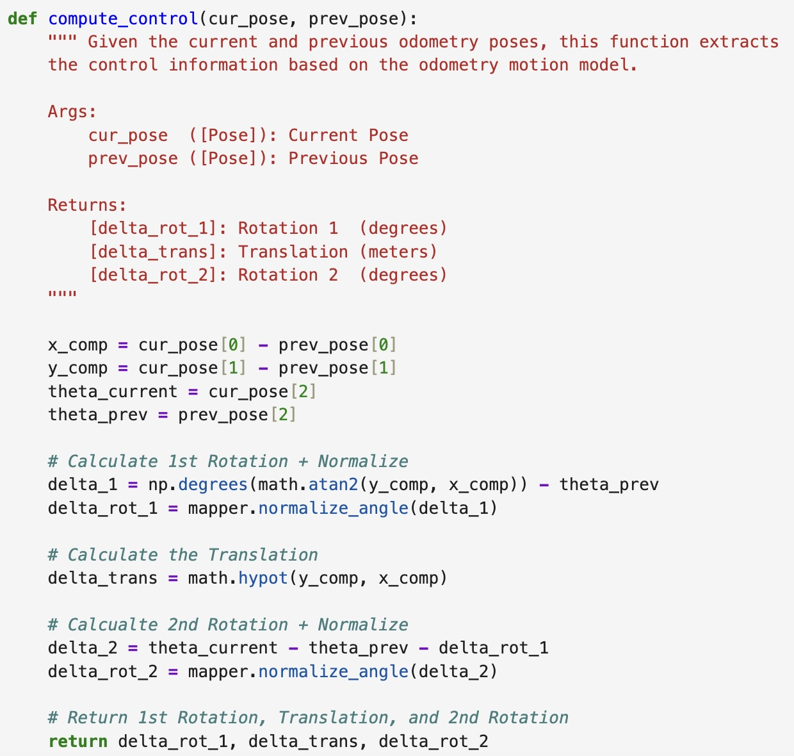
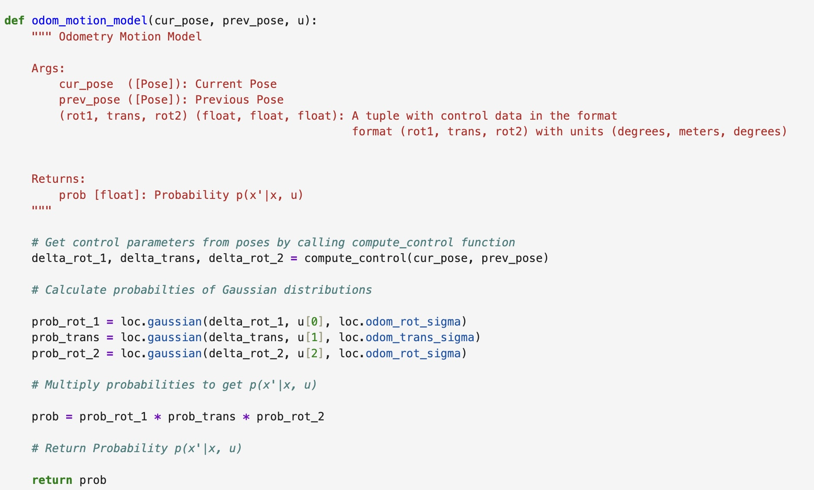
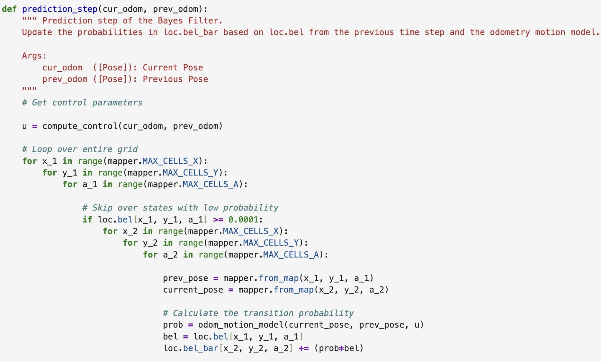
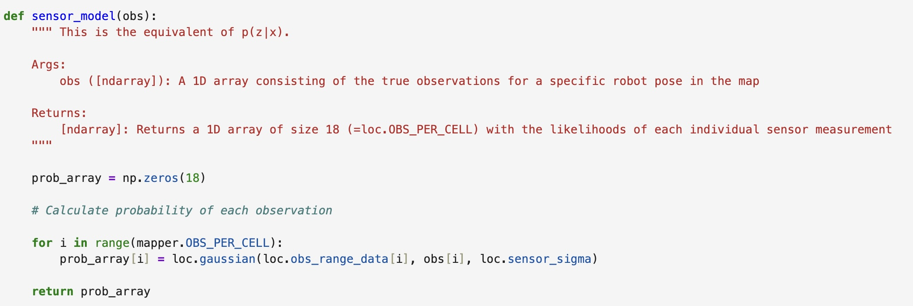
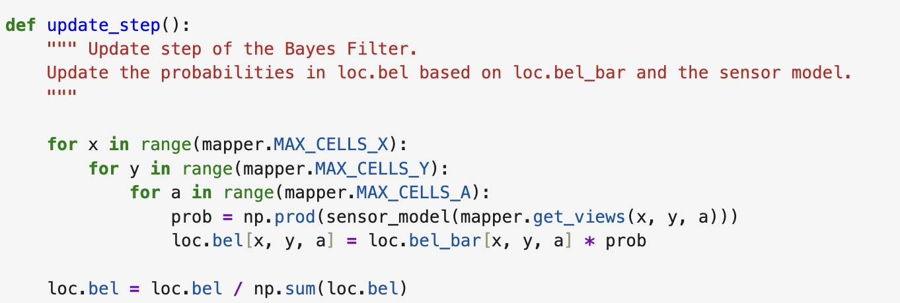
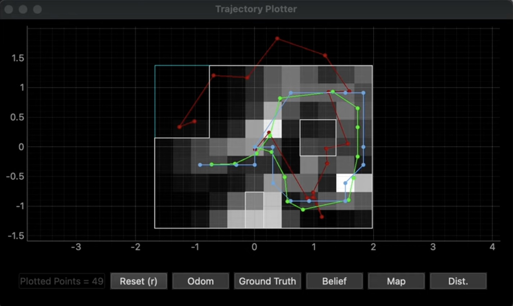
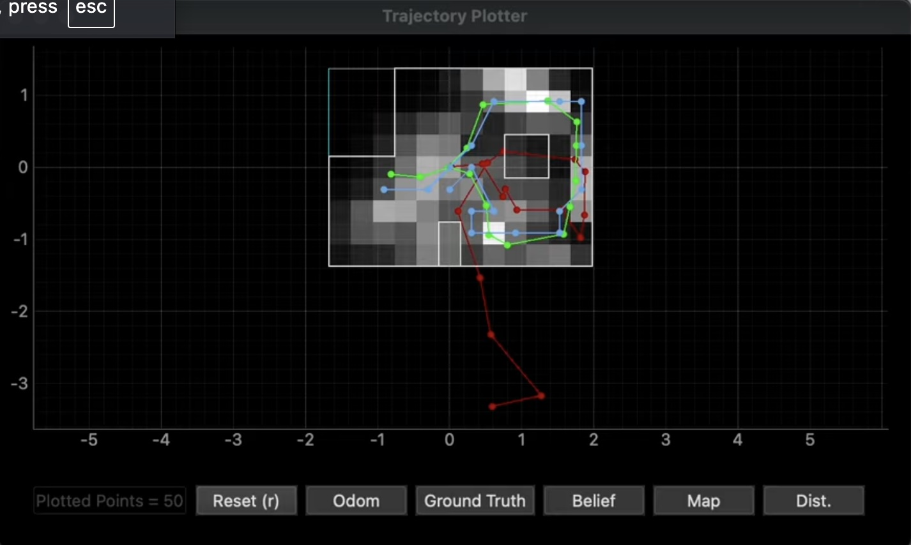

# Lab 10

## Pre Lab

For this prelab I followed through the instructional document. I installed the necessary dependencies, the correspopnding wheel file for my Python version (3.11) and OS, and the Box2D library. Once installed, I opened the demo in Jupyter Notebook to explore the different commands and how the robot responds. I ran the simulation using open loop control. I moved the robot around the space and observed its behaviors lasting indefinitely unless I provided a contradictory input. 

Below I've pasted a plot comparing the odometry and the ground truth from my initial open loop simulation. 

While the ground truth has some similarities to the actual map, the odometry is violently inaccurate. 

## Lab Tasks

For this lab, I will be writing multiple functions to implement the Bayes Filter algorithm show below:

### Compute Control

This function takes the current and previous poses and, using the equations below, is able to determine the first rotation, translation, and second rotation. 

The equations are modeled in Jupyter Notebook using the code below. First the differences in the x and y positions are calculated to find the x_comp and y_comp values. Then the rotations are calculated and normalized and the translation is calculated. 

### Odometry Motion Model

This function takes the current and previous poses, and then extracts the odometry model parameters using the previously defined compute_control() function. It then uses this data to calculate the probability of the parameters as Gaussian distributions. Lastly, these probabilities are multiplies together to calculate the probability of the entire motion and returns is as "prob". The Jupyter Notebook code for this function can be seen below:

### Prediction Step

This functon takes the current and previous odometetry states, and extracts the odometry model parameters using the compute_control() function. It then uses 6 for loops to calculate the probability that the robot has moved to the next grid cell. I implemented an if statement into the code which helps speed up the filter. If the belief is < 0.0001 then the second half for loops will not be entered as it is sufficienly unlikely that the robot will be in the remaining grid cells. The code used is shown below: 

### Sensor Model

This function takes in an array of observations and then calculates the probabiltiies of each occuring as a Gaussian distribution. This function returns an array "prob_array" of the same length as the observation array which consists of the likelihood of each event. 

### Update Step

This function iterates through all the cells in the grid and calculates their probabilities using the previously defined sensor_model() function. This proabability is then multiplies by the predicted belief in order to update the belief. The belief is then normalized. The code used is shown below:

## Bayes Filter Simulation Results

Below are the results for the two trials I ran of my Bayes Filter simulation. The green line depicts the ground truth, the blue line shows the belief, and the red line depics the odometry measurements. Both simulations ran for 15 iterations. The different shades of the grid cells represent the strength of the belief with the lighter color cells representign higher belief values. 

### Trial One

<iframe width="560" height="315" src="https://www.youtube.com/embed/cE_Z_0qnsog?si=rlP8GpGwsETJlYUh" title="YouTube video player" frameborder="0" allow="accelerometer; autoplay; clipboard-write; encrypted-media; gyroscope; picture-in-picture; web-share" referrerpolicy="strict-origin-when-cross-origin" allowfullscreen></iframe>

Trial One Final Graph: 

### Trial Two

<iframe width="560" height="315" src="https://www.youtube.com/embed/ZtpZJqpl0EI?si=ahSAOEqxUV4g7A40" title="YouTube video player" frameborder="0" allow="accelerometer; autoplay; clipboard-write; encrypted-media; gyroscope; picture-in-picture; web-share" referrerpolicy="strict-origin-when-cross-origin" allowfullscreen></iframe>

Trial Two Final Graph: 

Given the varying strength in belief values across the map, it is clear that this approach functions best when using consistent data. When applying this to our physical robot, issues may arise given that the ToF sensors can produce noisy data due to a variety of factors. This is something which will need to be accounted for as we transition to Lab 11.

### References

For this lab I referenced the lab write ups of former students Stephan Wagner, Mikayla Lahr, and Nidhi Sonwalker. I used ChatGPT to help identify errors in my python code. 
