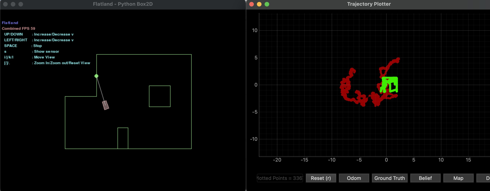

# Lab 10

## Pre Lab

For this prelab I followed through the instructional document. I installed the necessary dependencies, the correspopnding wheel file for my Python version (3.11) and OS, and the Box2D library. Once installed, I opened the demo in Jupyter Notebook to explore the different commands and how the robot responds. I ran the simulation using open loop control. I moved the robot around the space and observed its behaviors lasting indefinitely unless I provided a contradictory input. 

Below I've pasted a plot comparing the odometry and the ground truth from my initial open loop simulation. 

While the ground truth has some similarities to the actual map, the odometry is violently inaccurate. 

## Lab Tasks

For this lab, I will be writing multiple functions to implement the Bayes Filter algorithm show below:

### Compute Control

### Odometry Motion Model

### Prediction Step

### Sensor Model

### Update Step

## Bayes Filter Simulation Results

### Trial One

<iframe width="560" height="315" src="https://www.youtube.com/embed/cE_Z_0qnsog?si=rlP8GpGwsETJlYUh" title="YouTube video player" frameborder="0" allow="accelerometer; autoplay; clipboard-write; encrypted-media; gyroscope; picture-in-picture; web-share" referrerpolicy="strict-origin-when-cross-origin" allowfullscreen></iframe>

### Trial Two

<iframe width="560" height="315" src="https://www.youtube.com/embed/ZtpZJqpl0EI?si=ahSAOEqxUV4g7A40" title="YouTube video player" frameborder="0" allow="accelerometer; autoplay; clipboard-write; encrypted-media; gyroscope; picture-in-picture; web-share" referrerpolicy="strict-origin-when-cross-origin" allowfullscreen></iframe>

### References

For this lab I referenced the lab write ups of former students Stephan Wagner, Mikayla Lahr, and Nidhi Sonwalker. I used ChatGPT to help identify errors in my python code. 
