# Lab 11

## Lab Tasks

### Localization in Simulation

I ran the Bayes Filter simulation provided to us in notebook *lab11_sim.ipynb* which resulted in the final plot shown below:

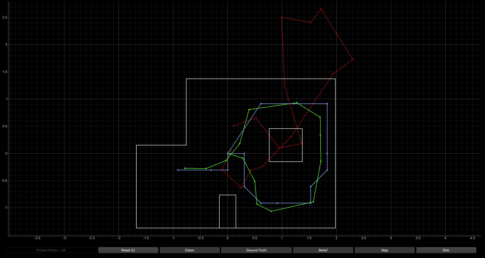

The red line represents the odometry, the green is the ground truth, and the blue line represents the belief. 

### Arduino Code

In order to perform localization, I adapted my code from Lab 9 in in order to rotate my robot 360 degrees and collect distance measurements in a a predefined interval. I adapted my code to best fit the purposes of this lab. For this, I defined 2 cases "MAP_ORIENTATION" and "SEND_MAP_ORIENTATION_DATA". The first case initiates/terminates orientation control while the second sends the collected data. All additional code was integrated into "void loop()" 

*Note: Apologies for the bluriness of these pictures, I can't figure out why they look like that*

#### MAP_ORIENTATION

I revised my codes from Lab 9 & 11 such that my robot would turn in 20 degree increments. The code I used can be found below:

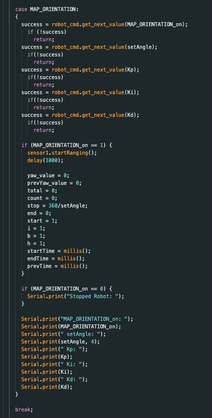

#### SEND_MAP_ORIENTATION_DATA

I also revised my code for sending data such that it only collects the angle, time, and distance data at each angle increment. The code I used can be found below:

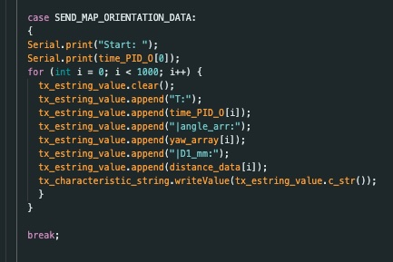

#### VOID LOOP()

In my main loop I used a flag variable to turn on the orientation and begin data collection to store distance data and yaw values within their respective arrays. The code I used can be found below:

  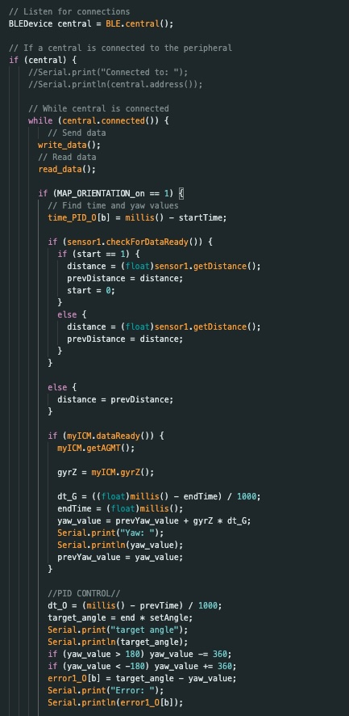
  

#### Data Collection

<iframe width="355" height="631" src="https://www.youtube.com/embed/E5WVWCPvDYA" title="LAB 11 Orientation Control Mapping" frameborder="0" allow="accelerometer; autoplay; clipboard-write; encrypted-media; gyroscope; picture-in-picture; web-share" referrerpolicy="strict-origin-when-cross-origin" allowfullscreen></iframe>

*Note: My phone is almost completely out of storage hence the abrupt stop. I unfortunately forgot to make room and record a better video before going home to write up this report*

### Implementing PERFORM_OBSERVATION_LOOP

This function is designed to collect the 18 data points documented during the MAP_ORIENTATION case's 360 degree rotation and store the data points in the arrays *sensor_ranges* and *sensor_bearings*. These arrays are then returned and used during the update step. I utilized the asyncio function such that I could run the while loop continuously until all the data points were sent over. The for loop then attaches the data points to their corresponding array as well as converts the mm values into meters. 

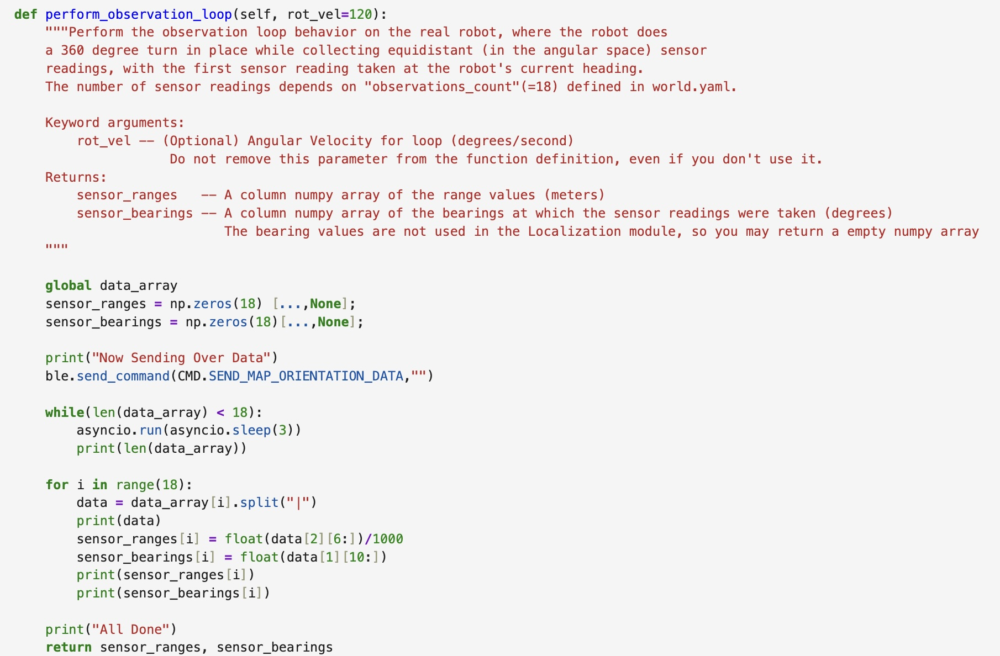

I put my command to begin the rotation outside of the defintion of the perform_observation_loop function. In doing so, I made it easier to begin/terminate the rotation. The command I wrote to run the MAP_ORIENTATION case can be seen below:

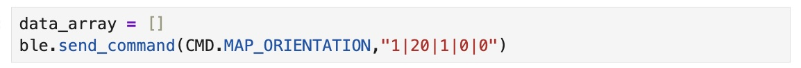

### Running Robot Localization (Run One)

Below you will find the results of my real robot localization across the four predetermined positions (-3, -2), (0, 3), (5, -3), and (5, 3). At each point, I began my robots angular position at 0 (facing the right). After many trials and tribulations, I got two good runs for each of the desired points (omitting the origin). On the plot, the green represents the ground truth (i.e. the actual location of the robot) and the blue represents the belief of the robot's position. I collected data with my ToF sensor located at the front of the car, turning my robot in a counter clockwise direction. 

#### Top Right (5, 3)

  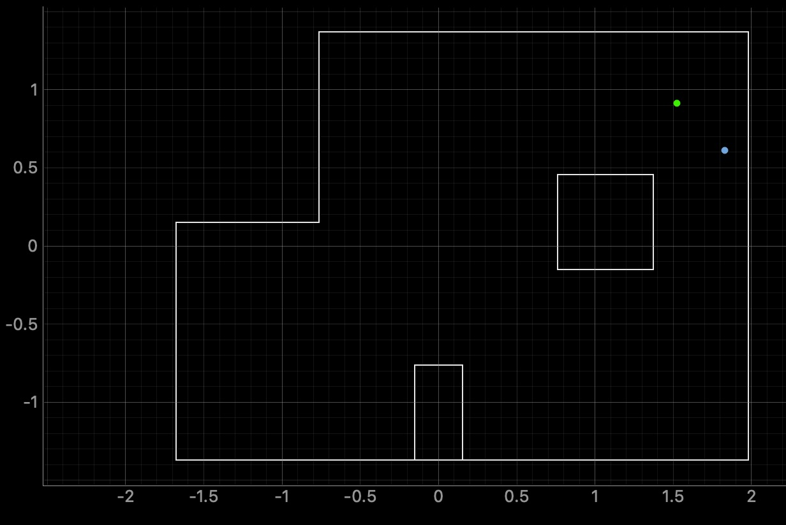
  

The ground truth pose was (1.524, 0.914, 0.000) and the computed belief pose was (1.829, 0.610, 10.000) which yields a resultant error of (-0.305, -0.305, -10.000). The result is a bit off with the calculated belief sitting south east of the actual ground truth position of the robot. 

#### Bottom Right (5, -3)

  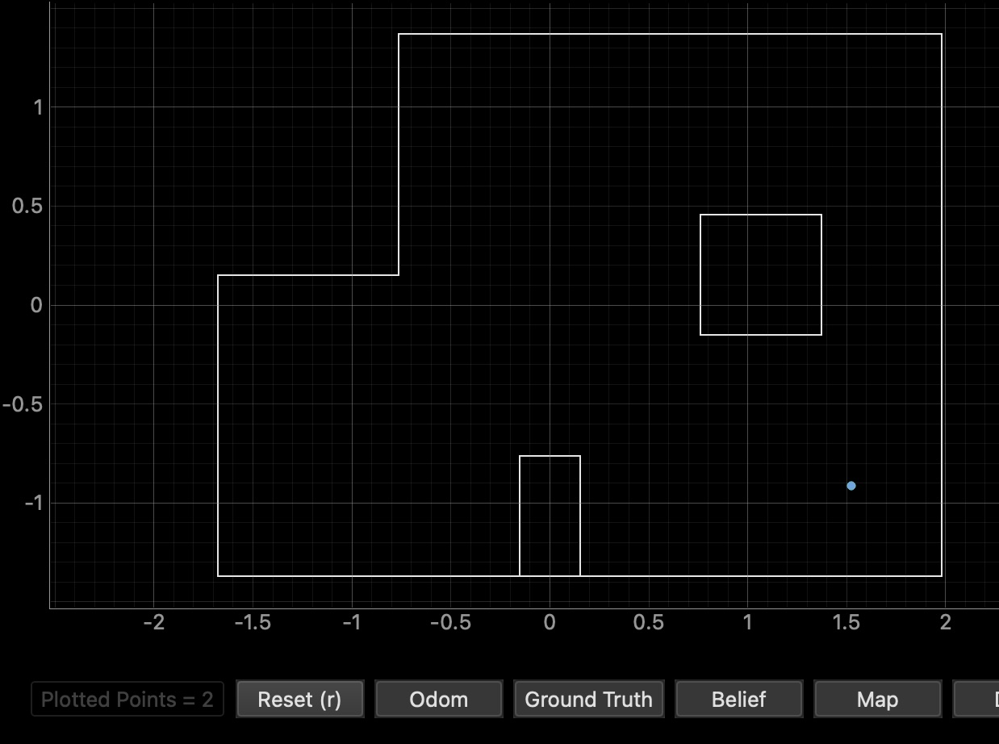
  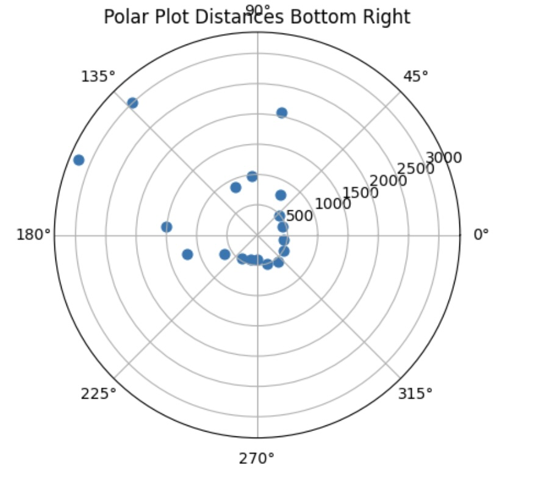

The ground truth pose was (1.524, -0.914, 0.000) and the computed belief pose was (1.524, -0.914, 10.000) which yields a resultant error of (0.000, 0.000, -10.000). On the plot only one dot appears due to the fact that the ground truth and belief are directly on top of each other. However, there is still an error of 10 degrees which is interesting.  

#### Top Middle (0, 3)

  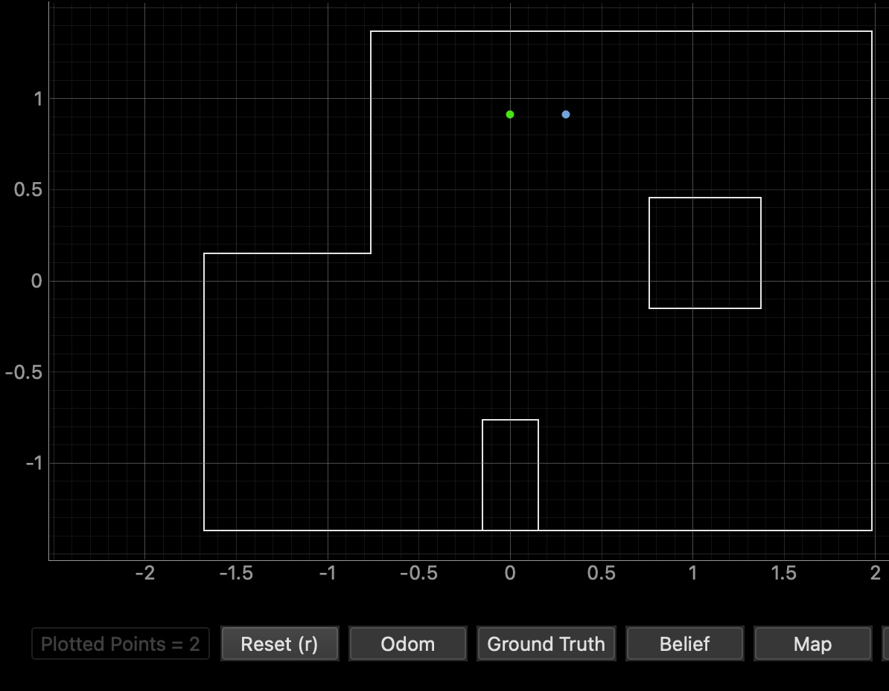
  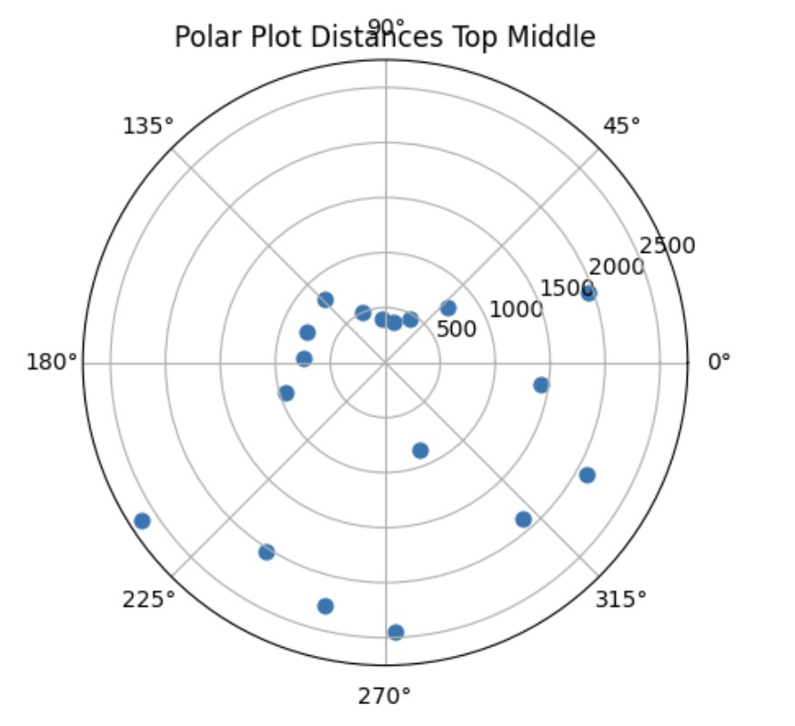

The ground truth pose was (0.000, 0.914, 0.000) and the computed belief pose was (0.305, 0.914, 30.000) which yields a resultant error of (-0.305, 0.000, -30.000). I believe that the presence of this error was that this was one of my poorer attempts in which the wall was not as accurately sensed as normla. Regardless, it is still relatively close to the ground truth. 

#### Bottom Left (-3, -2)

  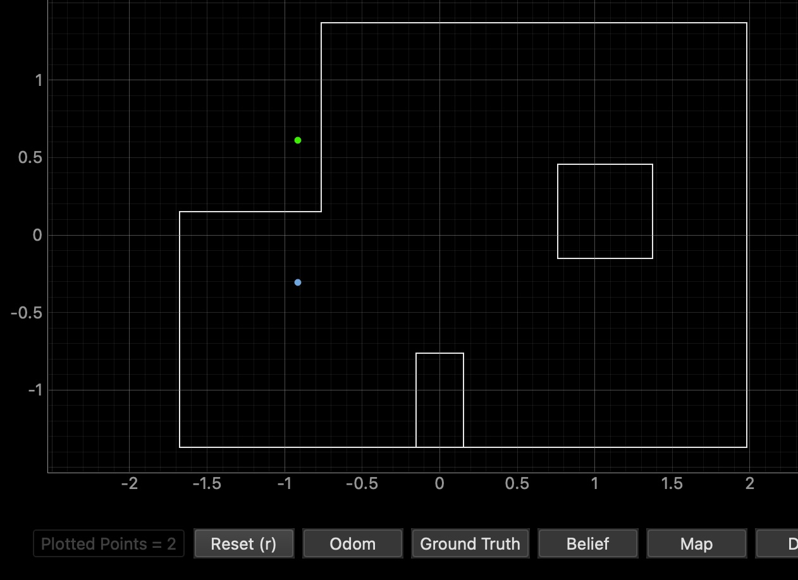
  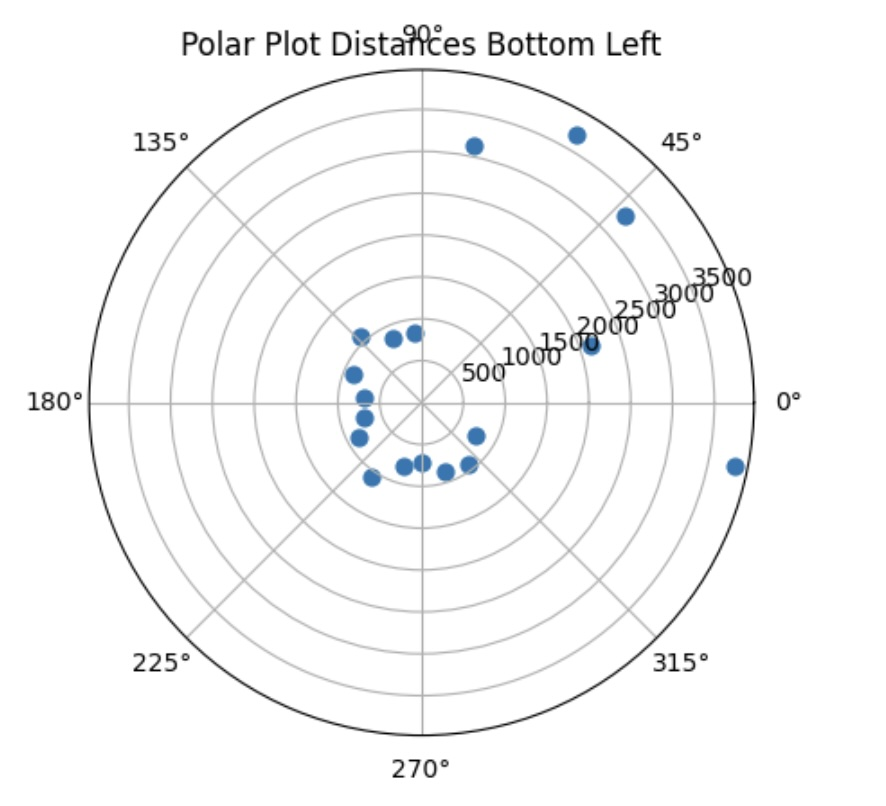

The ground truth pose was (-0.914, -0.914, 0.000) and the computed belief pose was (-0.914, -0.305, 10.000) which yields a resultant error of (-0.305, -0.609, -10.000). THe plot shows my belief to be significantly deviated from the ground truth (so far out that it is outside the boundary of the arena box itself.

### Conclusion

Unfortunately, I was unable to test a follow-up data collection at each point due to time constraints and some hardware issues which took up the majority of my time at office hours. However, I do anticipate that starting the robot in a different orientation would impact the accuracy of the belief reltive to the ground truth. Additioanlly, I would be interested in running the robot and collecting multiple data points at each angle and collecting an average distance to balance out the noise. 

### References

For this lab, I referenced Daria Kot, Stephan Wagner, Rahul Goel and Mikayla Lahr's labs from last year. Additionally, I recieved some help from Aleira Sanchez in fixing my orientation control code. I also used ChatGPT to catch any errors or logical errors in my code (of which there were unfortunately many)
