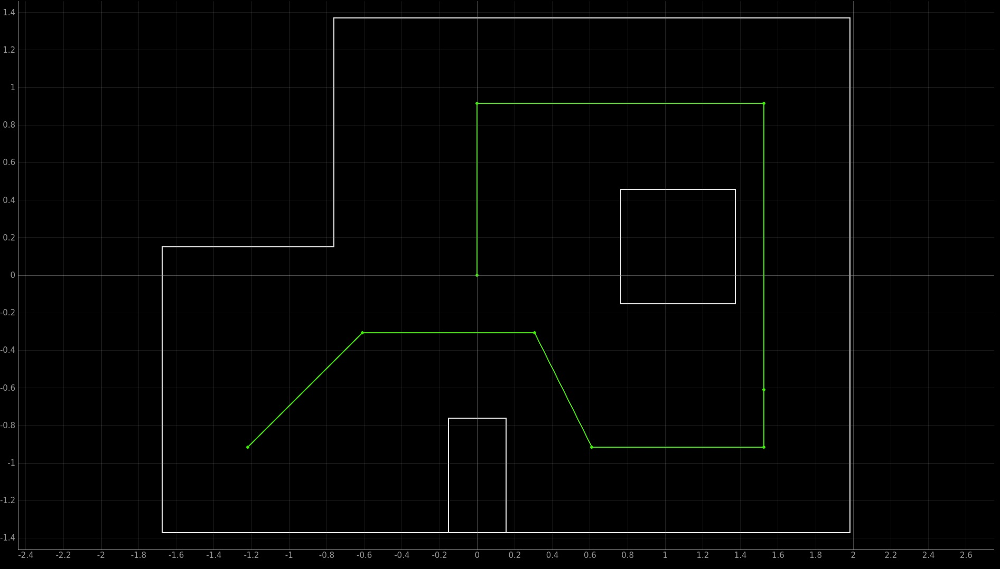
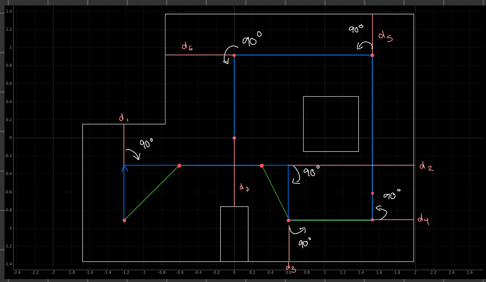
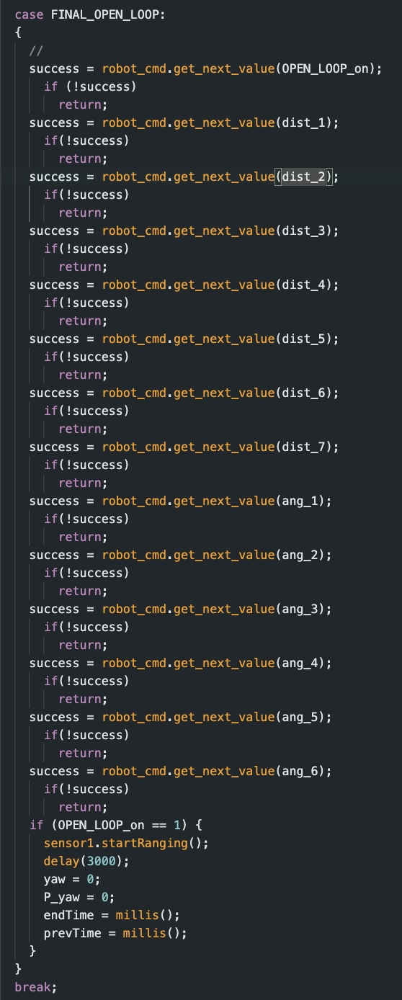
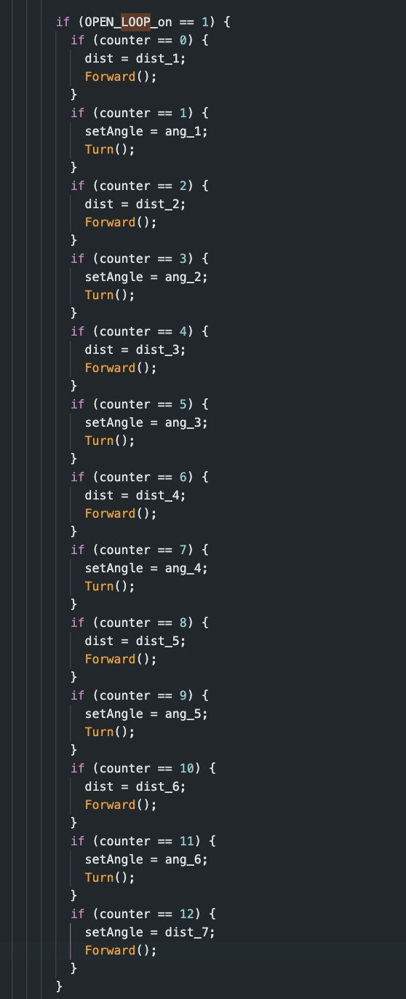
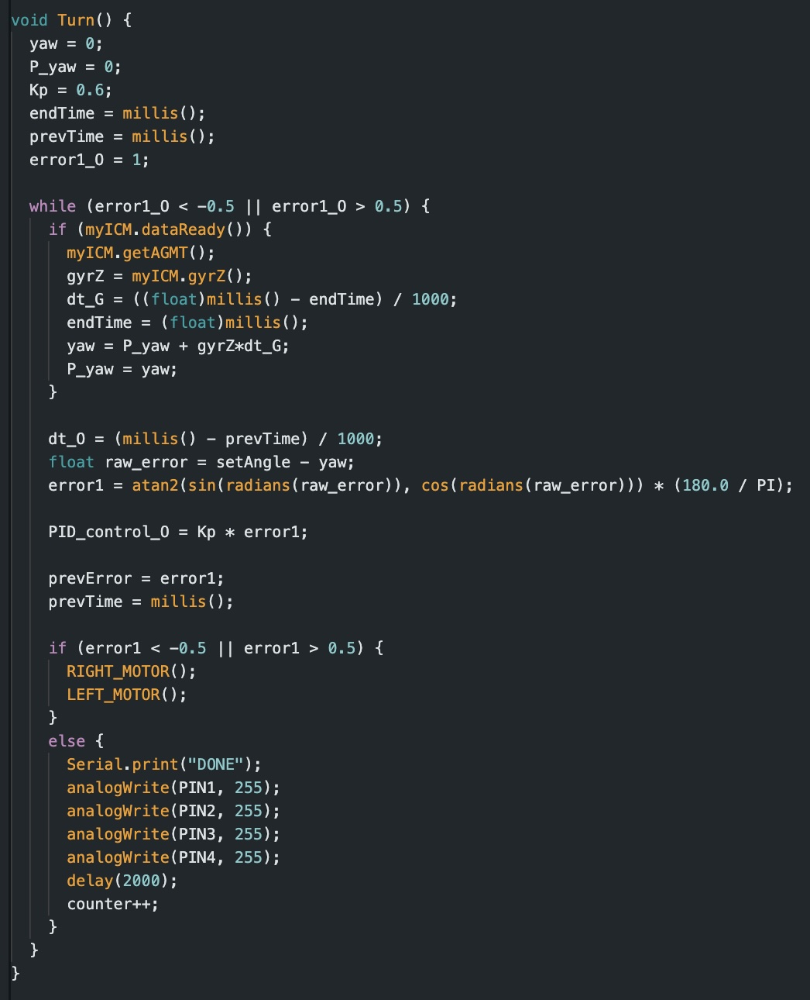
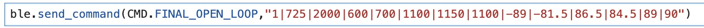

# Lab 12

## Lab Tasks

I figured the best way to approach this lab was to start with the simplest solution possible, and then increase system complexity as necessary until achieving a satisfactory solution. 

### ORIENTATION + MOTOR PID CONTROL

My plan was to implement a code which would have my robot follow the outlined path, using distance measurements from the front ToF sensor to know when to stop itself and turning to specific angles using orientation PID control. The primary goal here was to find out how well I could navigate across the points without implementing localization. I initially considered full open loop control and using timing to control 

While figuring out the necessary distances, I decided to pivot from the most direct path (shown below). 

During the beginning, instead of turning at 45 and 60 degree angles to follow the optimal path, I opted to instead use the trajectory below:

  

By implementing this path, open loop navigation becomes much more simple as all the necessary rotations become 90 degrees and the robot theoretically only moves in four fixed directions (up, down, left, and right). 

I implemented my code using a new case called FINAL_OPEN_LOOP (ironically titled because I forgot what open loop meant and did not realize this is technically a closed loop system until embarrassingly late) which takes in a total of 14 inputs. The code is shown below:

    

The first input corresponds to the variable OPEN_LOOP_on. Similar to other labs, this serves as a flag which intiiates the necessary functions inside the void loop when set to 1. The next 7 inputs correspond to the ToF sensor measurements at which the robot should stop. The following 6 inputs correspond to the angles of rotation for the robot in between each direct movement. I chose to have these values as inputs instead of hard coding them into my script to make adjusting values easier as I would not have to reupload my code each time. 

Given these inputs, when OPEN_LOOP_on is turned on, it triggers the following code to begin inside my void loop:

    

This code uses functions Turn and Forward which can be found below: 

  
  

The left and right motor functions are the same as the ones used in Lab 11 used for orientation PID control. 

### Attempts

I ran into 3 primary issues while fine tuning my values. 

1. Time of Flight sensor reading clower wall and immedialtly stopping. This would typically occcur when i set the first turn to be 90 degrees, but the actual turn itself executed at a lesser value closer to 87, orienting the robot's ToF sensor at the closer wall and immediately detecting the second distance. A failed attempt can be seen below:

<iframe width="560" height="315" src="https://www.youtube.com/embed/6TIp2HTQb8M?si=u0aj80qHQEGQahj5" title="YouTube video player" frameborder="0" allow="accelerometer; autoplay; clipboard-write; encrypted-media; gyroscope; picture-in-picture; web-share" referrerpolicy="strict-origin-when-cross-origin" allowfullscreen></iframe>

2. The performance of my code was very contingent on my battery being fully charged. As I ran more and more trials, my car began performing worse and worse. Degradation in the battery severely affected PWM consistency and in turn messed with many runs.

3. Slipping in the wheels caused for overshoot during rotation and driving. I had to account for this in my runs, typically making the angles a bit smaller than 90 degrees and increasing the ToF sensor distance so my robot would actually come to a complete stop at the right distance.

I ran my code many times, iterating each parameter and recharging my battery many times until I finally found the set of values that yielded the best results, show below

 

### Best Runs

<iframe width="560" height="315" src="https://www.youtube.com/embed/g1rToHfraVk?si=f3VgffnkgAABzjI6" title="YouTube video player" frameborder="0" allow="accelerometer; autoplay; clipboard-write; encrypted-media; gyroscope; picture-in-picture; web-share" referrerpolicy="strict-origin-when-cross-origin" allowfullscreen></iframe>

<iframe width="355" height="631" src="https://www.youtube.com/embed/Va-L4BG9KSg" title="Successful Run" frameborder="0" allow="accelerometer; autoplay; clipboard-write; encrypted-media; gyroscope; picture-in-picture; web-share" referrerpolicy="strict-origin-when-cross-origin" allowfullscreen></iframe>

These were two of my best run using the strategy described above. I was able to successfully hit at least within the square of each point. As a whole, I managed to successfully navigate about the path of coordinates, even if I was a bit off from perfectly hitting each point. 

## Conclusion

While I initially considered implementing localization techniques, I ultimately chose not to. My main goal was to explore how far I could get using a minimal system—relying solely on ToF-based stopping conditions and orientation PID control. This approach, though simple, proved to be surprisingly effective. The robot was able to reach the vicinity of each target coordinate with reasonable consistency.

Although the system occasionally sacrificed some accuracy, it offered a significant advantage in speed. Avoiding localization at every checkpoint reduced computational complexity and allowed for faster run times overall. Given these trade-offs, I was satisfied with the performance achieved without the added complexity of full localization. Additionally, the system I used made trouble shooting and parameter tweaking very easy. 

If I were to extend or refine this project, I would consider incorporating localization—particularly around points 3, 4, and 5, where the robot frequently encountered issues and required additional tuning. Targeted localization only in this region could help resolve some of the troubleshooting problems without needing to fully overhaul the system.

Overall, my results reinforced the idea that a lightweight, feedback-driven system can offer robust performance in controlled environments, especially when paired with careful tuning and strategic path planning.

## References 

I worked on this lab by myself. I referenced the lab reports of Daria Kot, Mikayla Lahr, and Nila Narayan. I used ChatGPT to find simple errors in my code and for help with formatting.

Thank you Professor Helbling and the TA team for a great semester! This class has been one of my favorites I've ever taken at Cornell and I've really learned a lot. 
