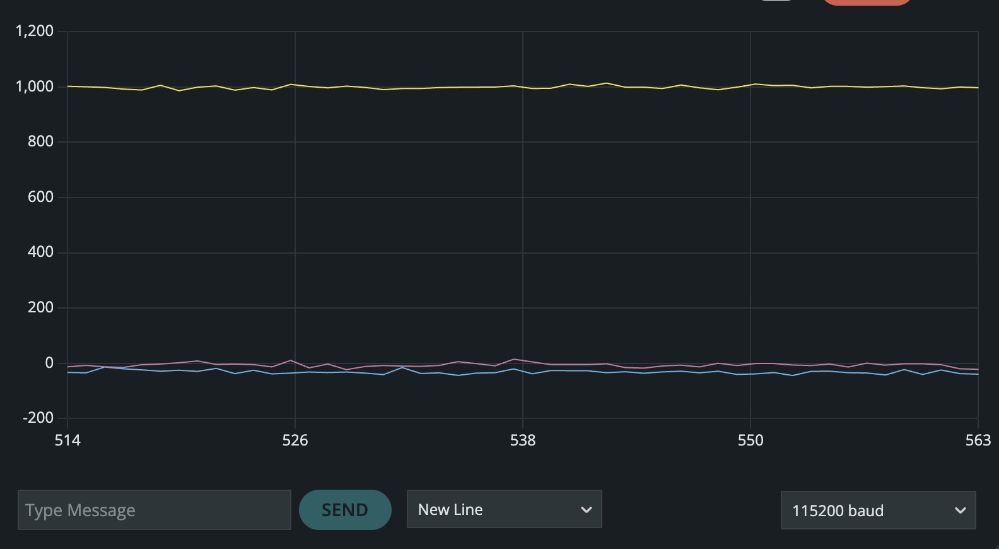
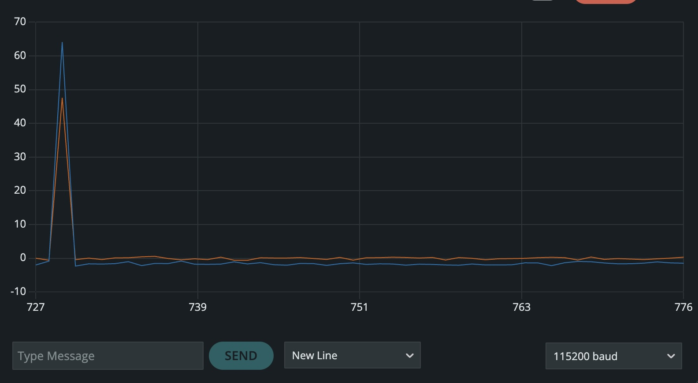
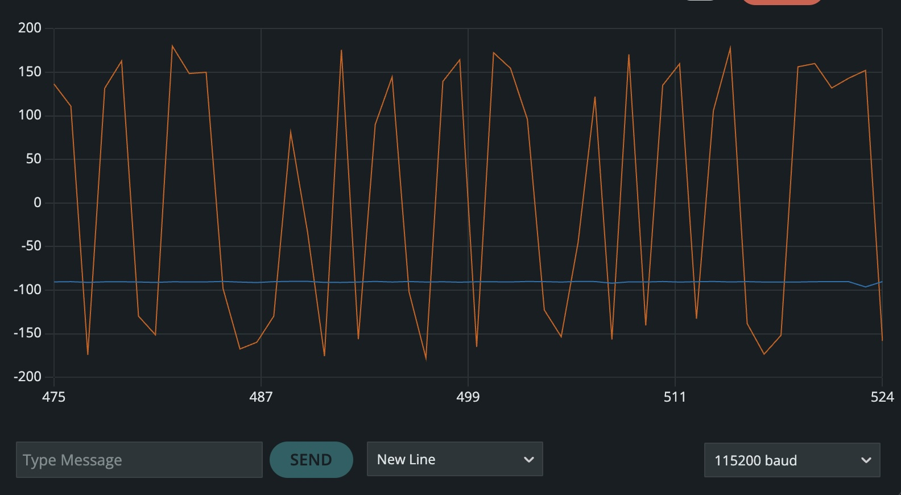
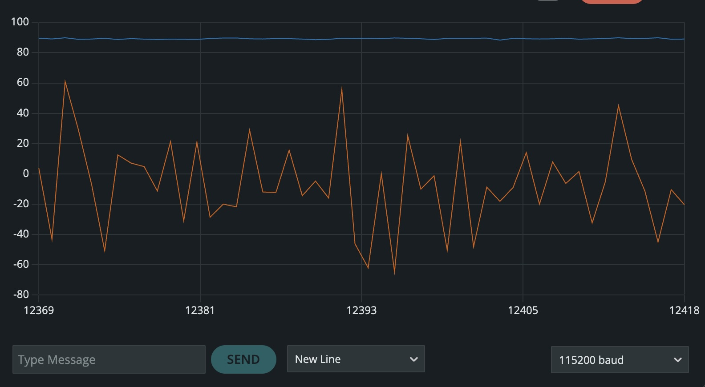
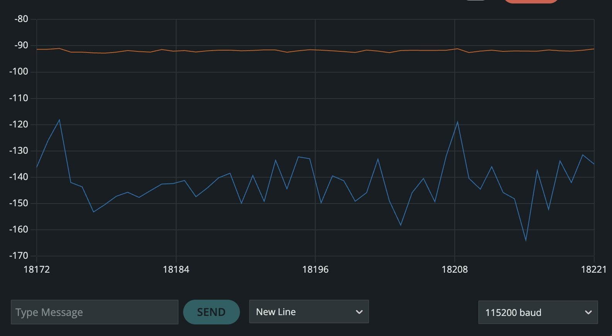
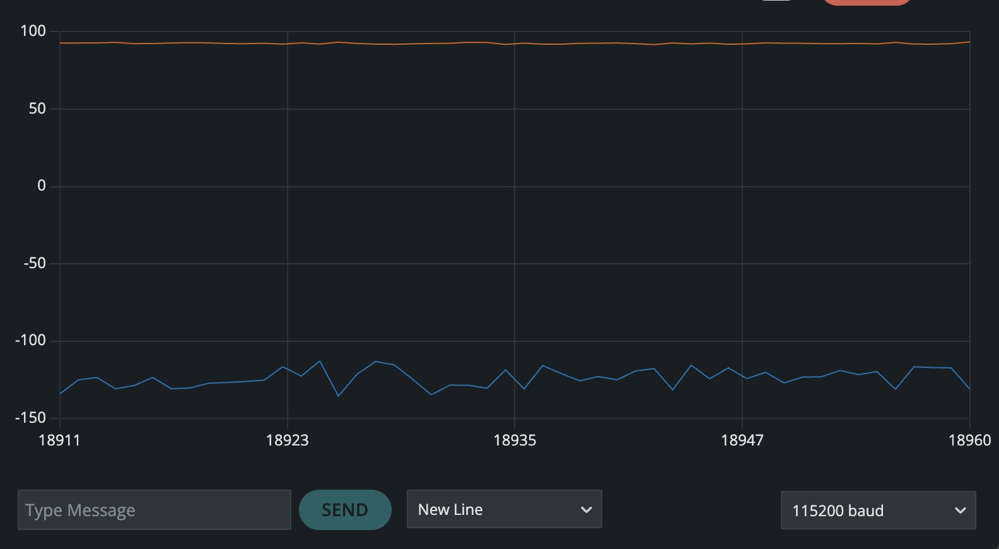
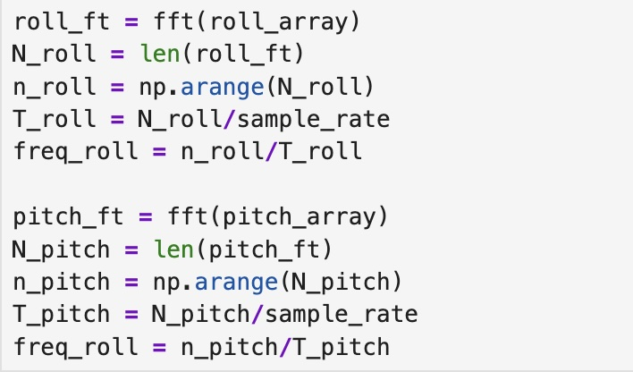

# Lab 2:

## Objective

## Setting up the IMU
Upon downloading the appropriate library in Arduino IDE, I connected the IMU to the Artemis board with the QWICC connecters. Once I ran the example code I was able to retrieve data from the IMU. My setup and the stream of data coming from the IMU can be seen below:

<iframe width="560" height="315" src="https://www.youtube.com/embed/oQgjbUPeMBo?si=c3XQVVKb3ApmwOkn" title="YouTube video player" frameborder="0" allow="accelerometer; autoplay; clipboard-write; encrypted-media; gyroscope; picture-in-picture; web-share" referrerpolicy="strict-origin-when-cross-origin" allowfullscreen></iframe>

The example code defines AD0_VAL = 1. This value refers to the ADR jumper on the back of the IMU. The default value for this is set to 1. However, when the ADR jumper is closed/soldered together, the value then becomes 0. The value for AD0_VAL determines what the I2C address of the IMU is. When AD0_VAL = 1, the IMU's address is 0x69. When the ADR jumper is closed, the I2C address is 0x68. 
## Accelerometer

To familiarize myself with the accelerometer, I placed the IMU in multiple orientations to analyze the different readings it was outputting. The acceleration data was reported in mg (milli - g). When I held the IMU right side up, flat on a table, the acceleromater read appeoximately 1000 mg in the z-axis and 0 acceleration in both the x and y. While in actuality, the x and y axes showed a range of values from 0-20, this can be assumed to be negligable given that the table is not perfectly horizontal. These values are sufficient to indicate minimal tilt. With regard to the z axis, the 1000 mg (1 g) shows that gravity was the preodominant acceleration detected by the IMU.

I implemented a visual signal to indicate taht the IMU had successfully turned on. I had the Artemis board blink its built in LED light each time pitch and roll data were collected. I heavily based this code on the Arduino Basics example we used for Lab 1. 

<iframe width="560" height="315" src="https://www.youtube.com/embed/Gncqb2XcBAM?si=0dwvNMSvsAPLD7Wa" title="YouTube video player" frameborder="0" allow="accelerometer; autoplay; clipboard-write; encrypted-media; gyroscope; picture-in-picture; web-share" referrerpolicy="strict-origin-when-cross-origin" allowfullscreen></iframe>

### 1. Accelerometer Data

Using the equations from class, I was able to convert accelerometr data into values of pitch and roll. While testing the IMU, I noticed that the accelerometer had very severe issues with noise under any orientation besides flat on the table (0 pitch and 0 roll). At 0 degrees of roll and 0 degrees of pitch, the accelerometer read consistently with what I was expecting. This data is plotted below:

For the orientation of -90 degrees roll and 0 degrees pitch, the accelerometer roll measurement is accurate, however, the pitch reading has significant noise and is almost impossible to read.

For 90 degrees roll and 0 degrees pitch, the results are similar to the prior example in which the the pitch is all over the place. However, the range of fluctuation for the pitch in case is smaller. Additionally, the rough average value of these fluctuations appears to lie at 0 degrees. Shown below:

For 0 degrees roll and -90 degrees pitch, the accelerometer pitch value was consistent with the orientation. However, instead of the roll reading 0 degrees, it was noisy and fluctuating between -120 and -160 degrees. 

For 0 degrees roll and 90 degrees pitch, the accelerometer pitch value was sitll consistent with the orientation. Similarly to the prior case, the roll reading was still in the -100's however with less noise in this case. 

From these inconsistent readings, it is quite apparent that the accelerometer is not always accurate. In order to account for this, we can do a two-point calibration such that our data matches our expected output. To do this I implemented the following technique: 

Calculate "RawRange" as RawHigh – RawLow.
Calculate "ReferenceRange" as ReferenceHigh – ReferenceLow
CorrectedValue = (((RawValue – RawLow) * ReferenceRange) / RawRange) + ReferenceLow

I got this technique from https://learn.adafruit.com/calibrating-sensors/two-point-calibration

#### Roll:

Reference Range: 90 - (-90) = 180

Raw Range: 89.46 - (-92.53) = 181.99

Roll Calibration: (((Raw Value - (-92.53)) * 180) / 181.99) + (-90)

#### Pitch:

Reference Range: 90 - (-90) = 180

Raw Range: 90.39 - (-91.57) = 181.96

Pitch Calibration: (((Raw Value - (-91.57)) * 180) / 181.96 + (-90)

### 2 and 3. Accelerometer Noise & Fourier Transform

As demonstrated in task 1, the accelerometer is incredibly sensitive to noise and its environment. In order to account for this and increase accuracy in data collection, the noise should be analyzed. To analyze the noise in the frequency spectrum, I implemented a Fourier Transform inspired by the "Fourier Transfer in Python" tutorial presenting in the lab. I recorded accelerometer data as arrays on the Artemis board and sent it to my computer to plot against its Fourier transform. The FT was achieved using the following code:

### 4. 

## Gyroscope

### 1. 

### 2. 

## Sample Data

### 1. 

### 2. 

### 3. 

### 4. 

## Stunt

<iframe width="560" height="315" src="https://www.youtube.com/embed/PwoHfEY-h6Y?si=pjLle83VeBbYdh0D" title="YouTube video player" frameborder="0" allow="accelerometer; autoplay; clipboard-write; encrypted-media; gyroscope; picture-in-picture; web-share" referrerpolicy="strict-origin-when-cross-origin" allowfullscreen></iframe>

