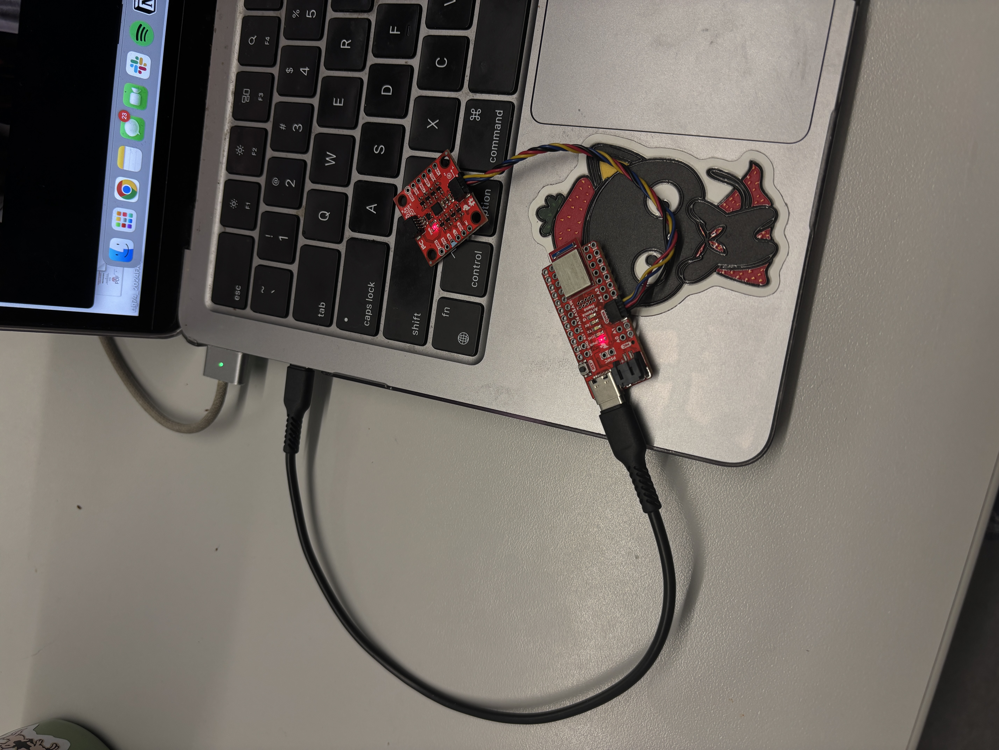

# Lab 2:

## Objective

## Setting up the IMU
Upon downloading the appropriate library in Arduino IDE, I connected the IMU to the Artemis board with the QWICC connecters. Once I ran the example code I was able to retrieve data from the IMU. My setup and the stream of data coming from the IMU can be seen below:

<iframe width="560" height="315" src="https://www.youtube.com/embed/oQgjbUPeMBo?si=c3XQVVKb3ApmwOkn" title="YouTube video player" frameborder="0" allow="accelerometer; autoplay; clipboard-write; encrypted-media; gyroscope; picture-in-picture; web-share" referrerpolicy="strict-origin-when-cross-origin" allowfullscreen></iframe>

The example code defines AD0_VAL = 1. This value refers to the ADR jumper on the back of the IMU. The default value for this is set to 1. However, when the ADR jumper is closed/soldered together, the value then becomes 0. The value for AD0_VAL determines what the I2C address of the IMU is. When AD0_VAL = 1, the IMU's address is 0x69. When the ADR jumper is closed, the I2C address is 0x68. 
## Accelerometer

### 1.
### 2.
### 3.
### 4. 

## Gyroscope

### 1. 
### 2. 

## Sample Data

### 1. 
### 2. 
### 3. 
### 4. 

## Stunt
*insert stunt video here
