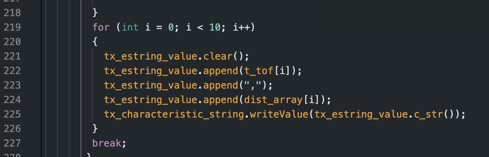
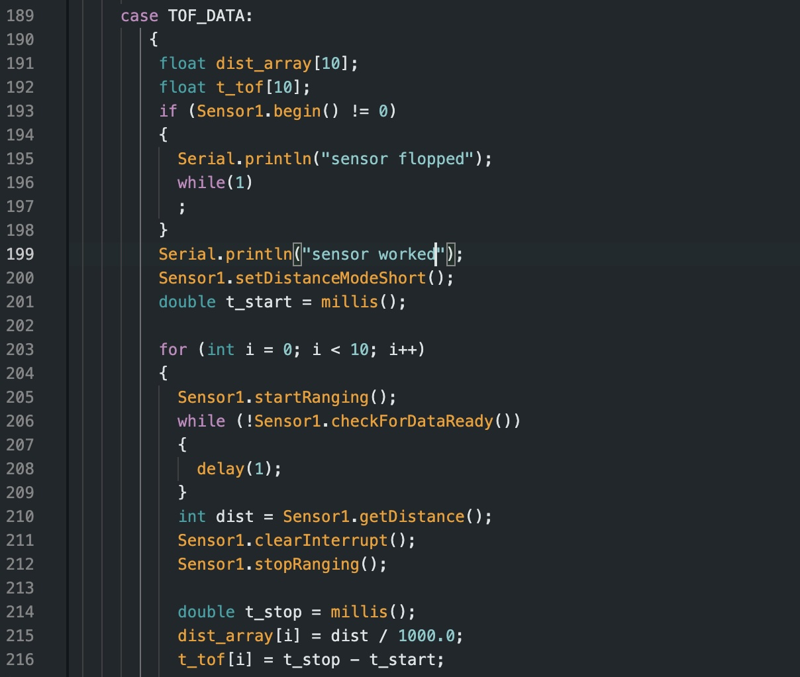
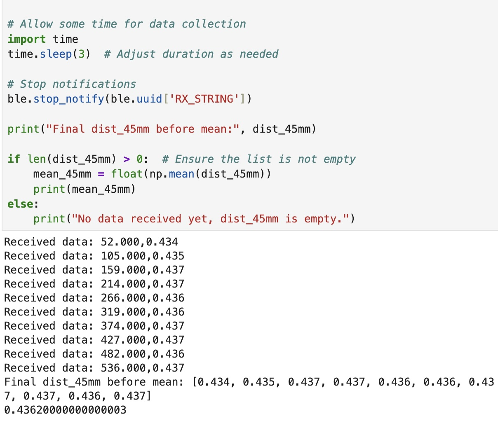
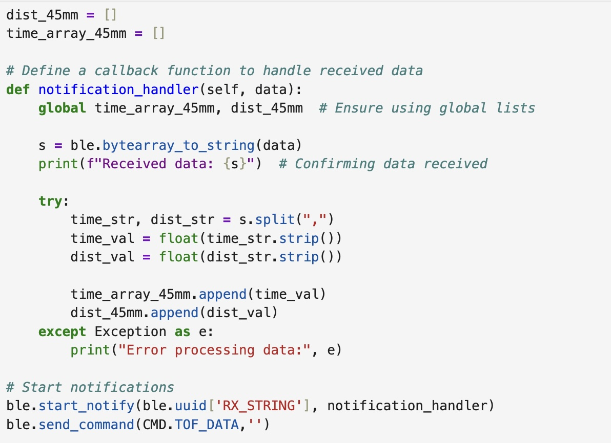
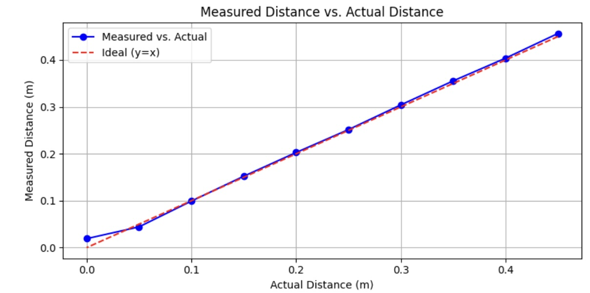

# Lab 3:

## Prelab

From the data sheet, the Time-of-Flight sensor's default I2C address is 0x52. Since both sensors have the same default address, I plan to use the XSHUT pin to change the address of one of the sensors to allow for simultaneous use. By soldering a wire to from one sensor's XSHUT pin to the Artmis board's A3, I can shut down the second ToF sensor while the first sensor is turned on, having one keep the deafult address and allowing the ther to be changed. I believe that this is a more compatible solution as opposed to the alternative since it minimizes wiring. 

I intend to place the two ToF sensors at the front of the robot in the left and right corners. This diagonal configuration will help to enhance object detection from the sides as well as provide a wider field-of-view than a tradtional heads-on placement. There is however potential for objects that are head on. 

I connected the Artemis Nano board to the QWIIC breakout board with one of the smaller two connectors. I then used the second smaller connector to connect the IMU to the QWIIC board. I then used the two longer connectors and soldered them directly to the ToF sensors. Using the longer connectors allows for more flexibility in where I'm able to place the sensors. 

Below is a circuit diagram of how I planned to wire up the components, followed by a picture of the actual wiring. 

## Lab Tasks

### 1.
In order to power the Artemis board without having it directly connected to my computer, I soldered the 650 mAh battery's wires to JST jumper wires and used heat shrink to insulate the exposed wire. Doing this allowed me to power up the Artemis with only the battery and transmit data via Bluetooth.

### 2-4.

Using the Arduino library manager, I installed the Sparkfun VL53L1X 4m laser distance library. I then connected the QWIIC board to the Artemis. From there I attached the ToF sensor to the QWIIC board by soldering it to the QWIIC cable. 

### 5. 

I ran the Example code for Wire I2C which allowed me to see the address of the sensor printed out in the serial monitor. Running the code gave me the following output:

This differed from my expectation given that the datasheet indicated that the default address for the ToF sensors was 0x52. This discrepancy can be explained by the fact that the data sheet presents the address in 8-bit representation whereas the Arduino uses a 7-bit address. The binary address was shited left by 1 which gets us from 0b1010010 (52) to 0b0101001 (29) in binary. 

### 6.

The ToF sensor has thre distance modes. These modes (short, medium, long) optimize ranging performance of the sensor given a specific maximum range. Respective to each mode, the maximum range can be set to 1.3m, 3m, or 4m. The longer the range, the further out the sensor can detect objects. However, a caveat to this is that the larger ranges make the sensor more susceptible to ambient light and noise. Short and long distance modes are both built-in, medium mode is only available wiht the Polulu VL53L1X library. I decided that for the purposes of this lab, I would use the short distance mode to reduce effects from ambient light and noise. This works well for my use case.

### 7. 

To collect data and test my chosen mode, short mode, I used the setup pictured below.

Using the white box provided to us as a flat wall, I collected data points starting at 45cm and decreasing in increments of 5cm until a 0 cm measurment. I did so to test the accuraccy of my ToF data while within the 1.3m maximum range. 

I wrote a new command in my Arduino code to collect data from my first ToF sensor. The command is listed below:

To collect this data and analyze it, I wrote the following code in python to generate arrays of the distance measurements, their means, the actual distance, the difference between the actual and recorded measurements, and the resulting standard deviation. The code is listed below:

Please note that I accidentally labeled my measurements as mm when they are actually meant to be cm.

From the plot below, it is evident that the data is very consistent with the actual distance being measured. The only notable discrepancy is at the 0 cm mark in which the sensor detects a distance despite the box being physically pressed against the ToF sensor. 

To further evaluate accuracy, I plotted the difference between the actual distance and measured distance against the actual distances. There was likely some human error present on my end given that the setup I used was 
