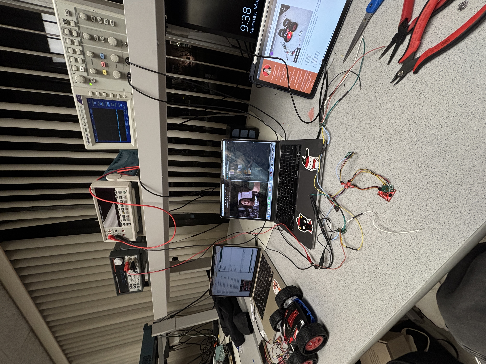
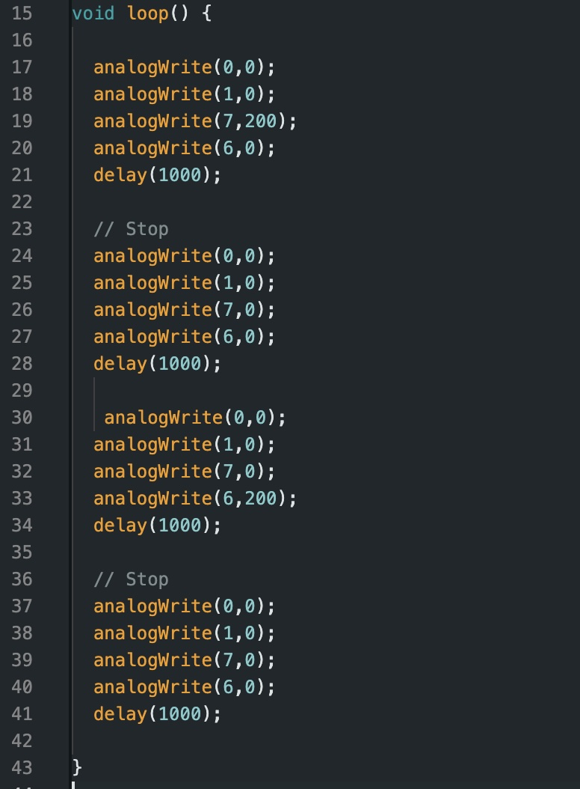
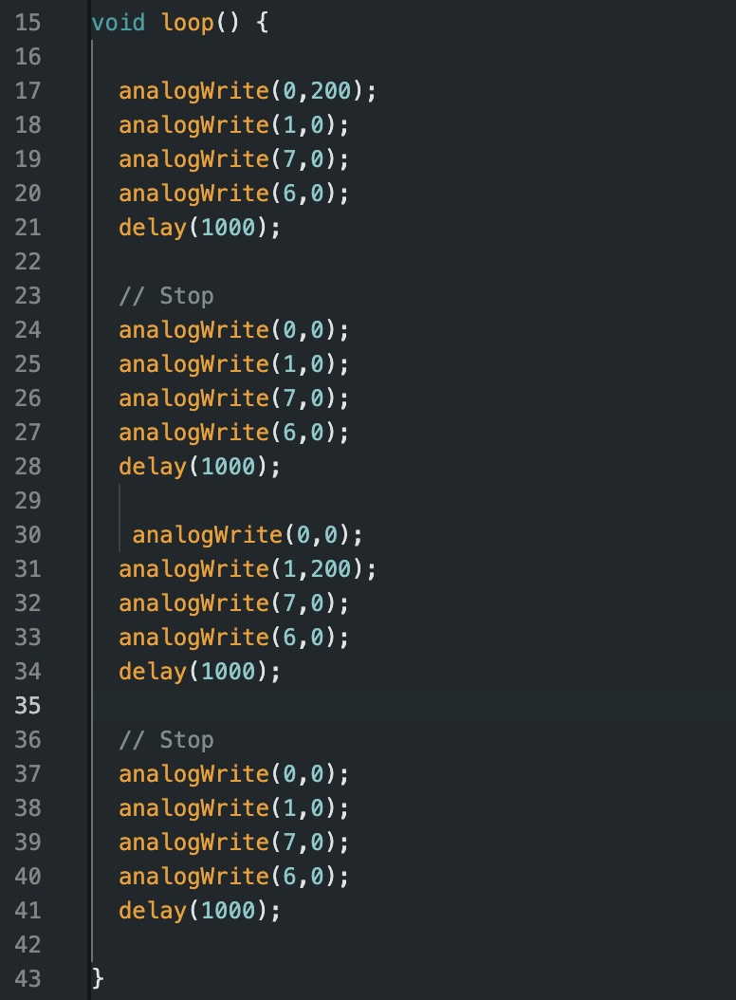
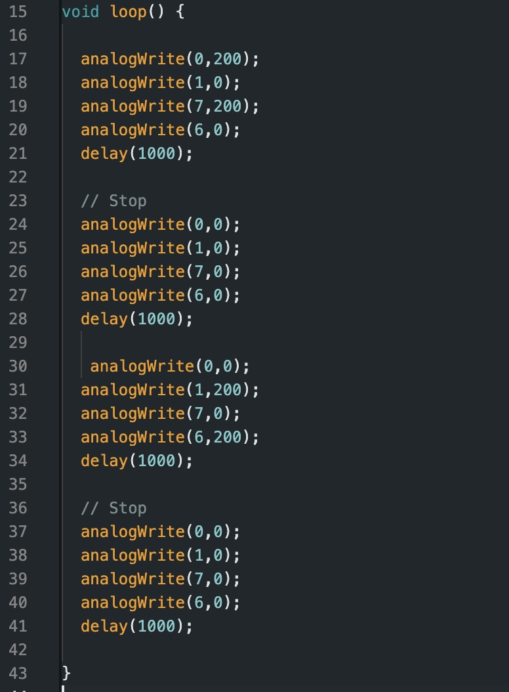
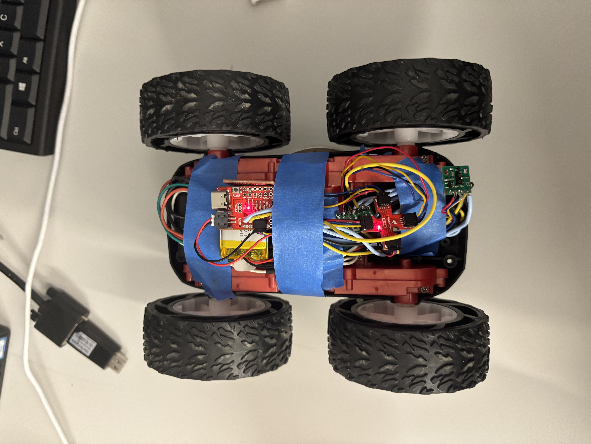

# Lab 4

## Prelab

Below is a wiring diagram for how I intend to connect the dual motor drivers to my Artemis board. I connected the two VIN pins togethers and then connected them to the battery. I did the same process for the two GND pins. I bridged together the BOUT1 and AOUT1 pins which I then connected to the DC motor. I did the same process for the BOUT2 and AOUT2 pins. This was done for both of the dual motor drivers. For my dual motor driver which was also connected to ground with the Artemis board, I bridged together BIN1 and AIN1  and connected that to pin 11 on the Artermis. The same was done for BIN2 and AIN2 which was connected to pin 12. On the other dual motor driver, I bridged BIN1 and AIN1 and connected them to pin to pin 6. BIN2 and AIN2 were also bridged together and connected to pin 7. 

*(Note: Due to some soldering problems I had to adjust my wiring such that instead of pins 11 and 12, I connected the BIN and AIN for the first driver to pins to 0 and 1 instead)* 

The Artemis board and the motors/motor drivers are being powered by seperate batteries such that the Artemis board is powered by a 650 mAh battery and the motors are powered by an 850 mAh battery. This was done intentionally. Having these components powered by different batteries allows them to function independently as well as avoids electrical noise and voltage drops caused by current fluctuation in the motors. Furthermore, the motors require a higher current battery as opposed to the Artemis board which is why they are being powered by the 850mAh battery. 

## Lab Tasks

### Testing w/ Oscilloscope and Power Supply

Below I've attached a picture of my setup and how I attached it to the connectors for the power supply and oscilloscope. I attached the positive wire from the power supply to the positive wire for the battery. I attached the ground wire for both the power supply and the oscilloscope to the ground wire of the battery. I connected the input to the oscilloscope to the different wire depending on which motor/pin I was testing. I tested all four wires that are attached to the motors to test my circuit by seeing if a PWM signal appeared on the oscilloscope. 

The power supply was set to a voltage output corresponding with the 850 mAh battery, 3.7 V. I tested each pin independently by setting one pin to an output of 200, and setting all other pins to an output of 0. I repeated this process four times, swirtching pins for each trial. The output voltage from the motor was then displayed on the oscilloscope. The PWM values indicate that power can be regulated on the dual motor driver. Below I've attached pictures of the Arduino code and the corresponding output on the oscilloscope. I defined my pins and used analogWrite() to assign the 200 ouput value to the corresponding pin, and output of 0 to all others. 

#### Pin 0 with Output 200:

  
  

#### Pin 1 with Output 200:

  
  

#### Pin 6 with Output 200:

  
  

#### Pin 7 with Output 200:

  
  

### Motor Testing

I tested each set of wheels by running different output values to each set. I used the same power supply output to power the motors. I tested the pins at output values of 100 and 200. From this testing I took note of the speed and direction which resulted. The wheels set to an output of 200 spun faster than when they were set to 100. Additionally, I found that pins 7 and 0 corresponded to driving the wheels forward when they were set to a non-zero values. Conversely, pins 6 and 1 corresponded to driving the wheels backward. 

Below I've attached two videos of my testing trials. The first video demonstrates when I set pin 0 to 200 and all else to 0, then repeated the process with pin 1. The second video demonstrates the same process with pins 6 and 7. 

*(Note: I accidentally soldered my battery wires to the motor drivers prematurely. To accomplish this step I connected a M-F wire to the battery connector and used that to connect to the power supply)*

<iframe width="560" height="315" src="https://www.youtube-nocookie.com/embed/ncc4j7PogI0?si=_pWYx9mZGO8WfLpm" title="YouTube video player" frameborder="0" allow="accelerometer; autoplay; clipboard-write; encrypted-media; gyroscope; picture-in-picture; web-share" referrerpolicy="strict-origin-when-cross-origin" allowfullscreen></iframe>

<iframe width="560" height="315" src="https://www.youtube.com/embed/hLiJENQMqYY?si=Ol3lN_WJ_0WFM-J7" title="YouTube video player" frameborder="0" allow="accelerometer; autoplay; clipboard-write; encrypted-media; gyroscope; picture-in-picture; web-share" referrerpolicy="strict-origin-when-cross-origin" allowfullscreen></iframe>

In terms of code, I used the two codes below with the left image pertaining the left set of wheels, and the right image pertaining the right set of wheels:

  
  

### Battery Powered All Wheel Spinning

For this step, I connected the 850 mAh battery and soldered it to properly connect my wires. Once done, I uploaded the following code which turns all the wheels forward, followed by a brief stop, and then turns all the wheels backwards. 

<iframe width="560" height="315" src="https://www.youtube.com/embed/zB5AEp2neBw?si=lEWp7rI7UwPgzvUb" title="YouTube video player" frameborder="0" allow="accelerometer; autoplay; clipboard-write; encrypted-media; gyroscope; picture-in-picture; web-share" referrerpolicy="strict-origin-when-cross-origin" allowfullscreen></iframe>

The code I used to run this loop can be found below:

### Car Setup and Initial Testing

Below is an image of how I attached all components to my car, allowing it to run independently. 

*(Note: This is a very temporary setup given that I still need to work on my ToF sensors functionality)*

After I connected all the components, I wanted to try a simple run through of how my robot moves. Below is a video of my car running a simple loop, where it drives forward, reverses, turns clockwise, then counterclockwise. From this initial test run I noted that when driving forward, my car skewed left. This is something I will address and calibrate later in the lab. 

<iframe width="560" height="315" src="https://www.youtube.com/embed/a_DNTH_fRwI?si=bcoqw6fgPoXI9IA7" title="YouTube video player" frameborder="0" allow="accelerometer; autoplay; clipboard-write; encrypted-media; gyroscope; picture-in-picture; web-share" referrerpolicy="strict-origin-when-cross-origin" allowfullscreen></iframe>

### Lower Limit PWM:

To identify the minimum PWM required to overcome friction when placed on the floor, I increased the PWM in increments of 5 until the robot started moving. Once the car overcame static friction, I lowered the output value until it stopped moving. From this I found that the lower threshold was around 52. This was from when the car was starting from a full stop. If already moving, the car only needed a value of 37 in order to begin driving. I also noted that during these trials, my left set of wheels did not spin at the same rate as my right set. They were significantly weaker than the right set. 

Turning proved to require a larger output thank simply moving forward. From my trials I found that a minimum output value of 72 was required to start rotation from a full stop. It should also be noted that throughout these trials, I used up a lot of the battery. As such, I assume these values would be lower on a fully charged battery.

*(Note: for these tests I kept the output value for both motors equal. Thus, the 52 output threshold was when both sides were set to 52. The same applies for the turning value.)*

### Calibration Factor

As previously stated, there was a disparity in my wheel rotation rate despite the output to both sides being set to equal values. This was causing a noteable skew to the left every time I ran my car. To resolve this, I have to implement a calibration factor such that both wheels spin at the same rate. During my analysis, I ran both wheels at an equal output. I set the output to 70 on each side. Additionally, I only ran the code for a two foot distance to speed up the process. From this reference value, I incrementally raised the left side's output until the car was able to drive in a straight line. Through continuous trial and error, I found that an output of 81 was able to keep the trajectory relatively straight. From this I was able to calculate a calibration factor of 81/70 ~= 1.16. 

I implemented these findings into the following code: 

While this works in theory, I ran into a problem towards the end of my testing for calibration. After hours of testing, my left side wheels stopped running consistently. While the right side was working consistently, the left side would not achieve their final rotation rate unless I physically spun the wheel with my hand. Due to the time constraints, I was unable to film a video of my car functionally driving in a straght line.

## References

For this lab, I primarily referenced the reports of Mikayla Lahr, Daria Kot, and Nila Narayan. Additionally, I attended office hours on Saturday, Monday, and Tuesday to debug my problems. I used ChatGPT to figure out how to add two pictures side by side on my website. 
