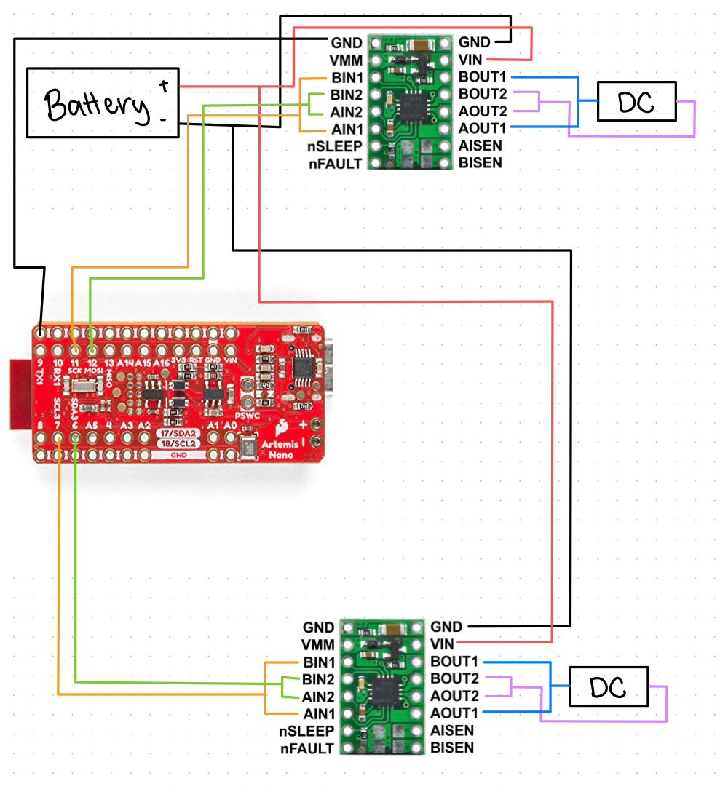
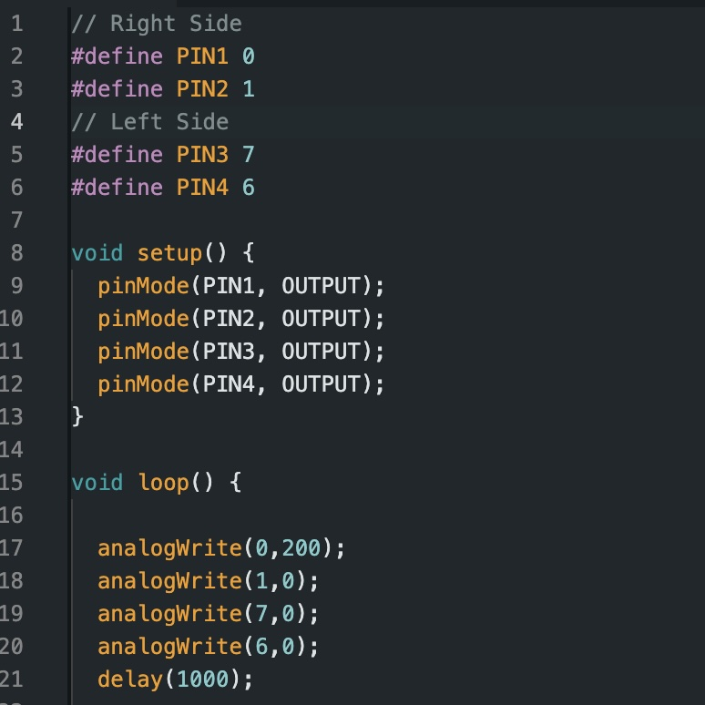
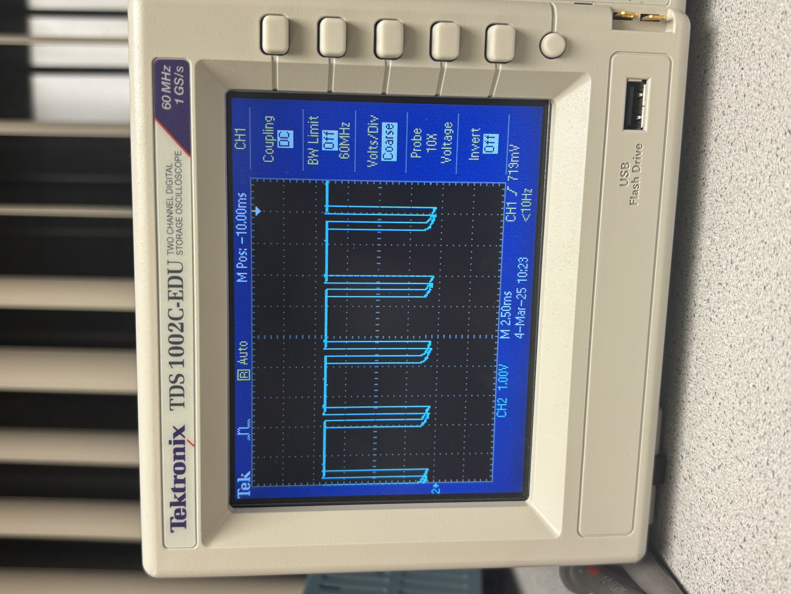
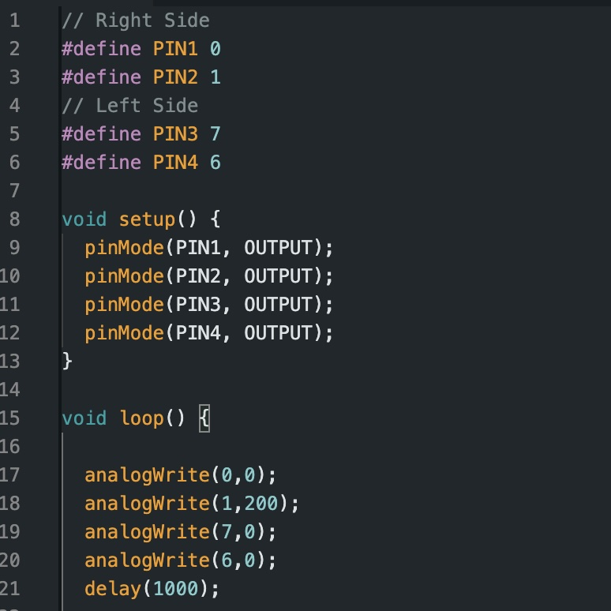
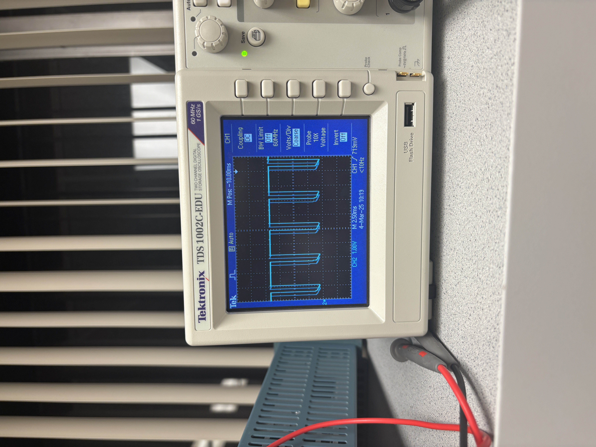
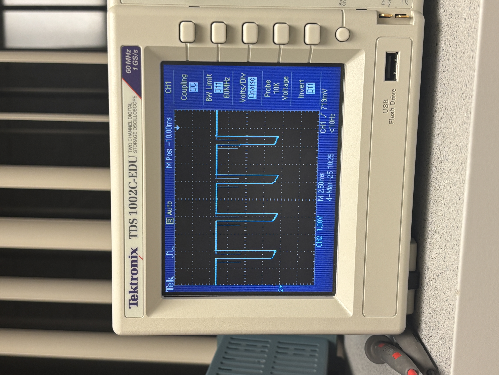
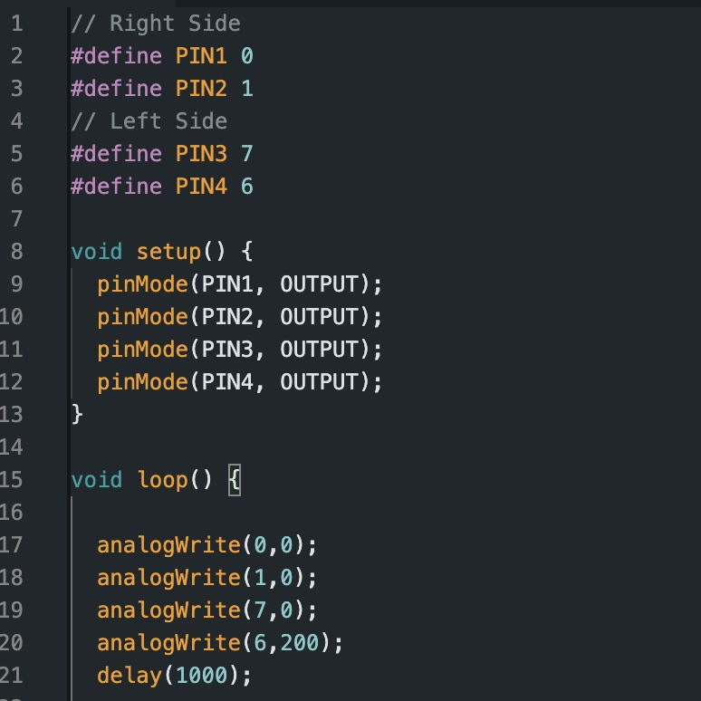
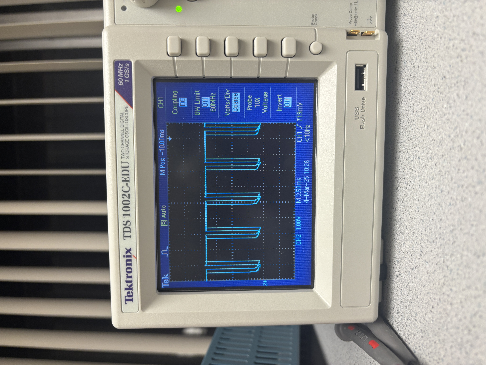

# Lab 4

## Prelab

Below is a wiring diagram for how I intend to connect the dual motor drivers to my Artemis board. I connected the two VIN pins togethers and then connected them to the battery. I did the same process for the two GND pins. I bridged together the BOUT1 and AOUT1 pins which I then connected to the DC motor. I did the same process for the BOUT2 and AOUT2 pins. This was done for both of the dual motor drivers. For my dual motor driver which was also connected to ground with the Artemis board, I bridged together BIN1 and AIN1  and connected that to pin 11 on the Artermis. The same was done for BIN2 and AIN2 which was connected to pin 12. On the other dual motor driver, I bridged BIN1 and AIN1 and connected them to pin to pin 6. BIN2 and AIN2 were also bridged together and connected to pin 7. 

*(Note: Due to some soldering problems I had to adjust my wiring such that instead of pins 11 and 12, I connected the BIN and AIN for the first driver to pins to 0 and 1 instead)* 

The Artemis board and the motors/motor drivers are being powered by seperate batteries such that the Artemis board is powered by a 650 mAh battery and the motors are powered by an 850 mAh battery. This was done intentionally. Having these components powered by different batteries allows them to function independently as well as avoids electrical noise and voltage drops caused by current fluctuation in the motors. Furthermore, the motors require a higher current battery as opposed to the Artemis board which is why they are being powered by the 850mAh battery. 

## Lab Tasks

### Testing w/ Oscilloscope and Power Supply

Below I've attached a picture of my setup and how I attached it to the connectors for the power supply and oscilloscope. I attached the positive wire from the power supply to the positive wire for the battery. I attached the ground wire for both the power supply and the oscilloscope to the ground wire of the battery. I connected the input to the oscilloscope to the different wire depending on which motor/pin I was testing. I tested all four wires that are attached to the motors to test my circuit by seeing if a PWM signal appeared on the oscilloscope. 

The power supply was set to a voltage output corresponding with the 850 mAh battery, 3.7 V. I tested each pin independently by setting one pin to an output of 200, and setting all other pins to an output of 0. I repeated this process four times, swirtching pins for each trial. The output voltage from the motor was then displayed on the oscilloscope. The PWM values indicate that power can be regulated on the dual motor driver. 

#### Pin 0 with Output 200:

  
  

#### Pin 1 with Output 200:

  
  

#### Pin 6 with Output 200:

  
  

#### Pin 7 with Output 200:

  
  

### Motor Testing

### 
