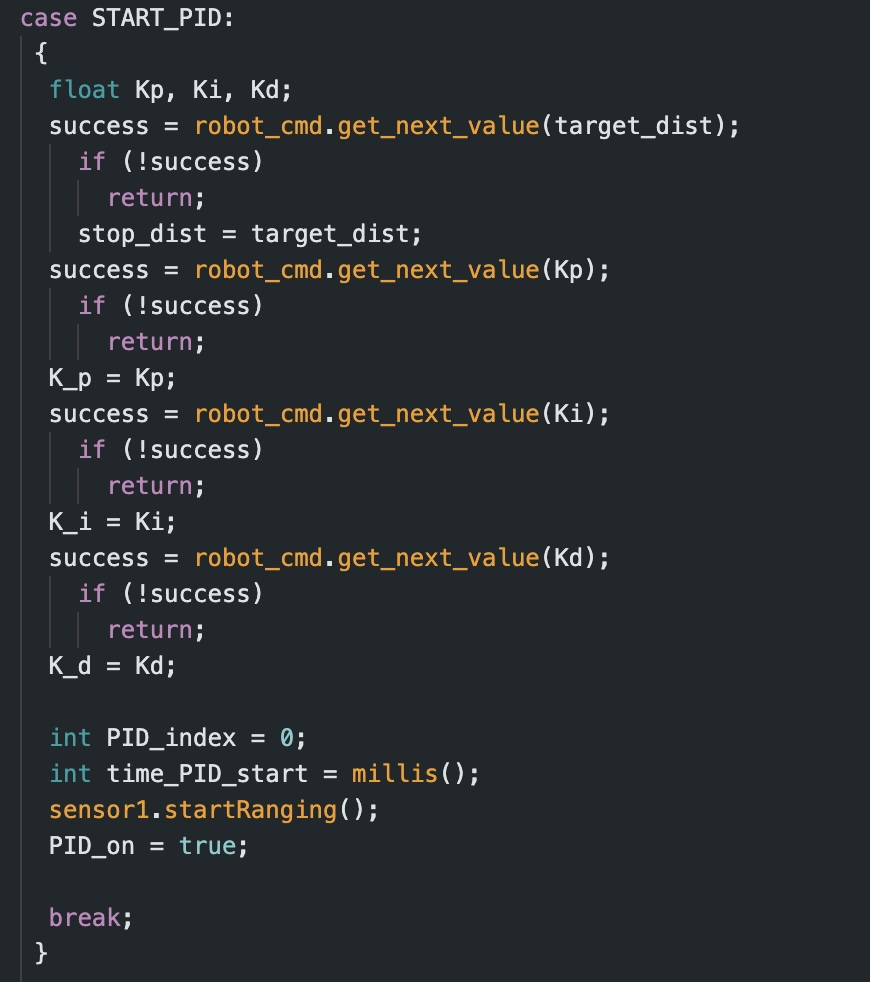
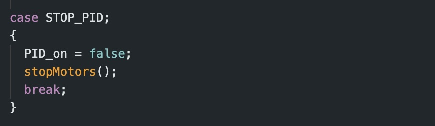
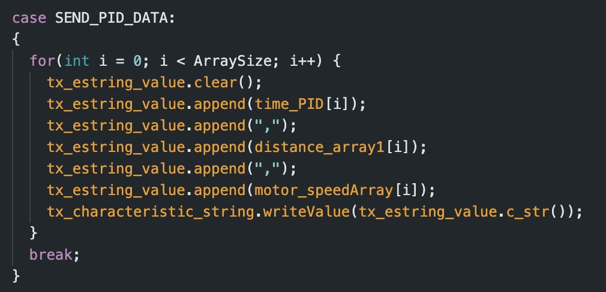

# Lab 5

For this lab, I have opted to implement a PID controller into my system. 

## Prelab

In order to simplify debugging, I first determined the method I would use to send and recieve data over Bluetooth. To accomplish this, I initialized three Arduino cases. 

### 1. START_PID
This case clears all previous data, starts my front ToF sensor, initiates storage of time data, and sets PID_on to true (this is initialized as false to keep the car off until the command is called). For the START_PID case, the command inputs consist ofthe desired end distnace from the wall (target_dist), as well as the three controller values (Kp, Ki, and Kd). 

### 2. STOP_PID
This case resets PID_on back to false and stops the motors from running. 

### 3. SEND_PID_DATA
This case transmits the collected PID data to my computer via Bluetooth. While designing the SEND_PID_DATA case, I decided that the relevant information that I needed to send to Jupyter Notebook consisted of: time, distance (inches), error, P, I, D, and PID values, as well as the motor input.

## Lab Tasks

Before implementing my PID controller, I ran some preliminary tests to see how my robot would perform with the task. To do so, I combined my codes from labs 3 and 4 to create a simple code which would drive the car forward at a set speed until the front ToF sensor detected a distance of 1 foot from the wall. To test the error, I placed a ruler next to my car to quantify how close it got to the wall before actually coming to a full stop. Starting at a base speed of 75, I ran this test until my robot got uncomfortably close to making a full speed collision with the wall. 

