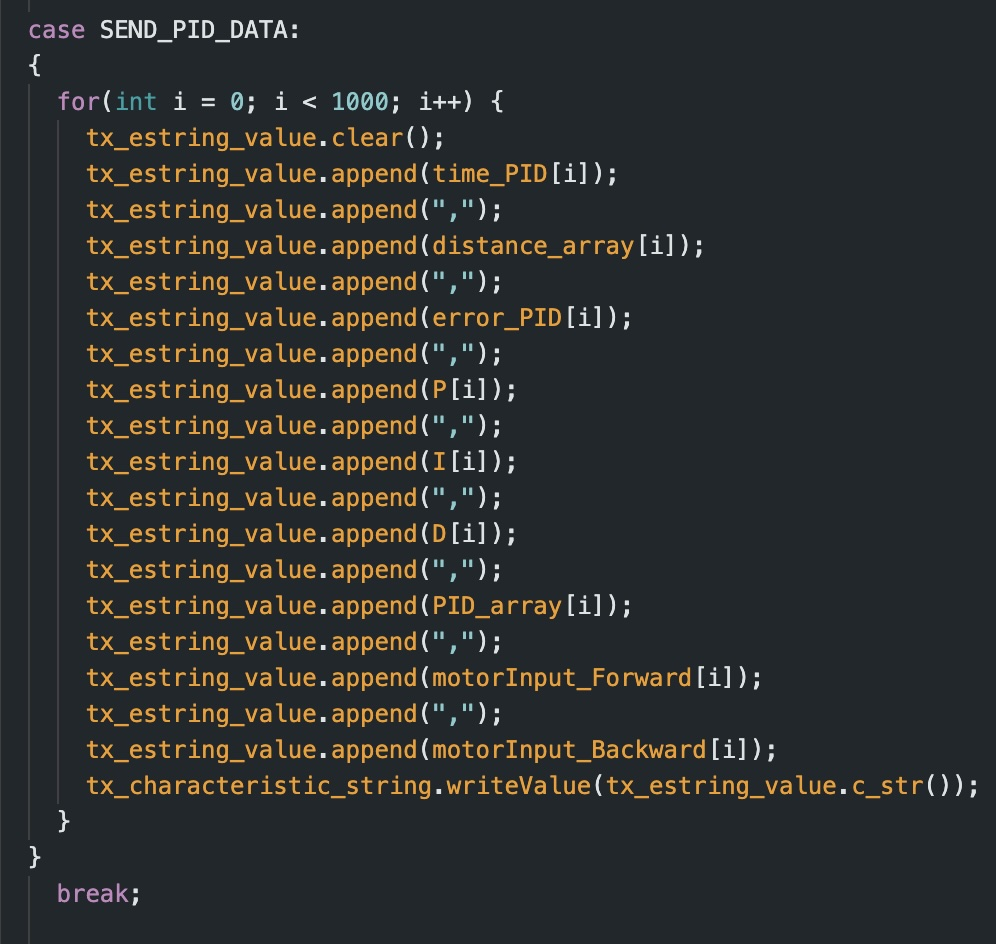
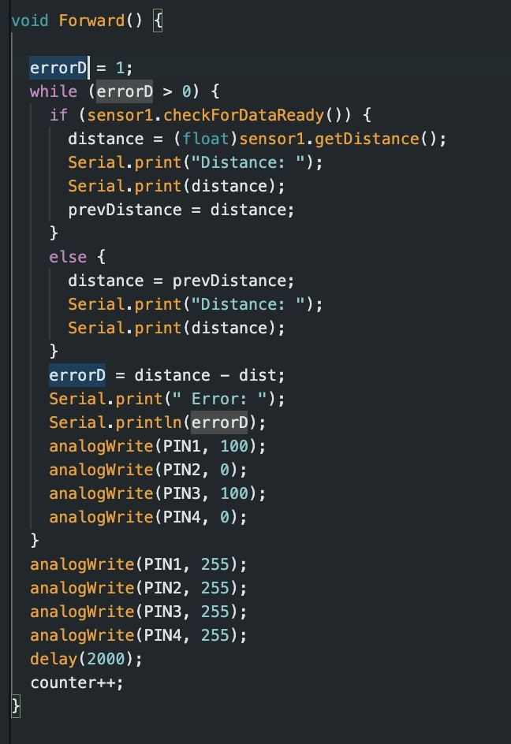
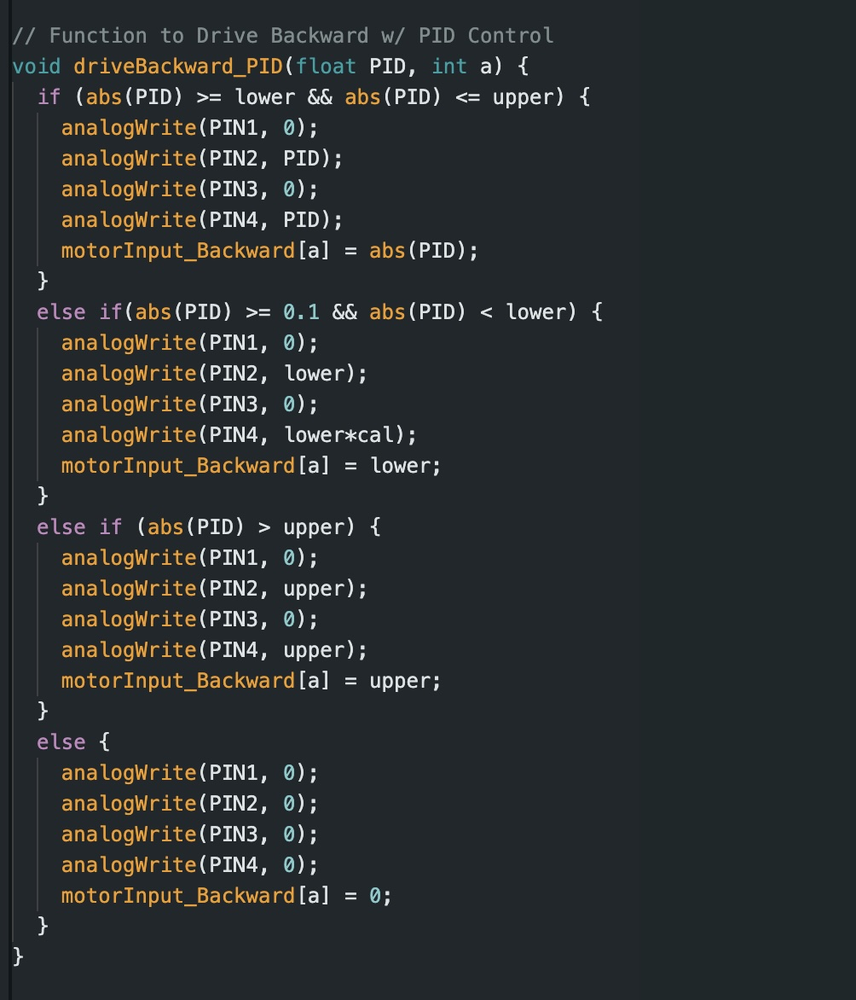

# Lab 5

For this lab, I have opted to implement a PID controller into my system. 

## Prelab

In order to simplify debugging, I first determined the method I would use to send and recieve data over Bluetooth. To accomplish this, I initialized three Arduino cases. 

### 1. START_PID
This case clears all previous data, starts my front ToF sensor, initiates storage of time data, and sets PID_on to true (this is initialized as false to keep the car off until the command is called). For the START_PID case, the command inputs consist ofthe desired end distnace from the wall (target_dist), as well as the three controller values (Kp, Ki, and Kd). 

### 2. STOP_PID
This case resets PID_on back to false and stops the motors from running. 

### 3. SEND_PID_DATA
This case transmits the collected PID data to my computer via Bluetooth. While designing the SEND_PID_DATA case, I decided that the relevant information that I needed to send to Jupyter Notebook consisted of: time, distance (inches), error, P, I, D, and PID values, as well as the motor input.

Additionally, I implemented a hard stop feature into my code such that if the Bluetooth connection fails, all pin values will be set to 0. Once my code is outside the while loop I have for "central.connected()" (indicating that the Artemis board is no longer connected) the robot will come to a complete stop.

## Lab Tasks

Before implementing my PID controller, I ran some preliminary tests to see how my robot would perform with the task. To do so, I combined my codes from labs 3 and 4 to create a simple code which would drive the car forward at a set speed until the front ToF sensor detected a distance of 1 foot from the wall. My car immediatly slammed into the wall.

### Position Control

For this task, I implemented PID control such that it can adapt to changing conditions such as starting distance from the wall. I wrote code in my loop function that is continously checking the status of PID_on which can either be set to 0 or 1 (off or on). When set to 1, the robot starts collecting data, and moving.

#### Sampling Frequency of ToF sensor

#### Proportional Control

I started by implementing proportional control and troubleshotting the ideal Kp value for my robot. For the P controller, my robot adjusts its movement depending on its distance from the goal of one foot. Based on this, it will either move forward (or backward if it overshoots) at a corresponding PWM. The output speed is dependent on the error (the distance read by the ToF sensor - the goal distane) and the Kp value.

The movement of the car was determined by two functions driveForward_PID and driveBackward_PID. These two functions (shown below) set the motor speed and direction depending on the PID value and ensured that the value was within bounds.

  
  

As a starting value, I set my Kp value to be 0.1. I conduted multiple tests with different Kp values to find the optimal value for my system. At Kp = 0.1, my robot would hit the wall well before it started reversing. At Kp = 0.05 my robot managed to stop however it was just shy of hitting the wall before it began to reverse. I found that the optimal value was Kp = 0.01 
