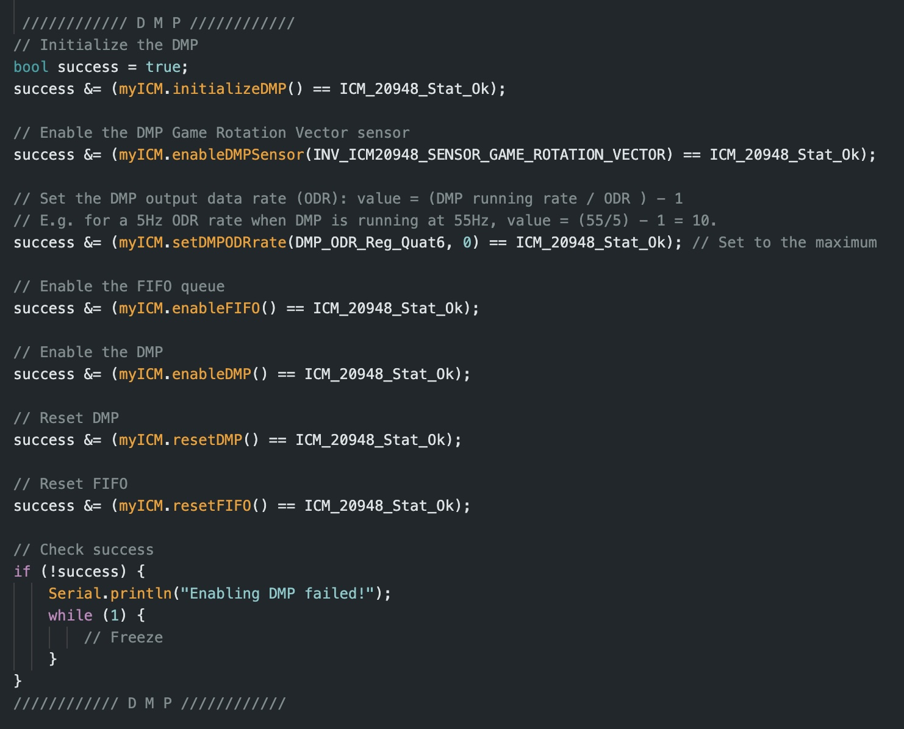
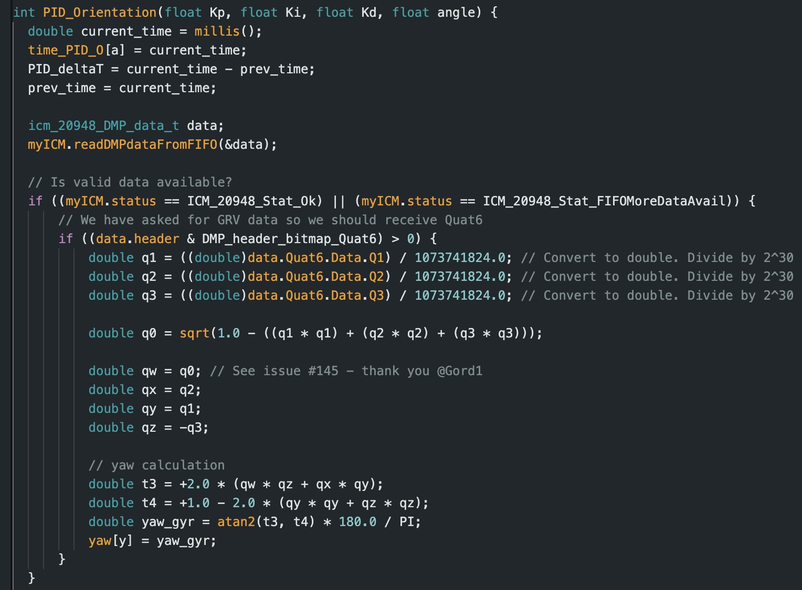
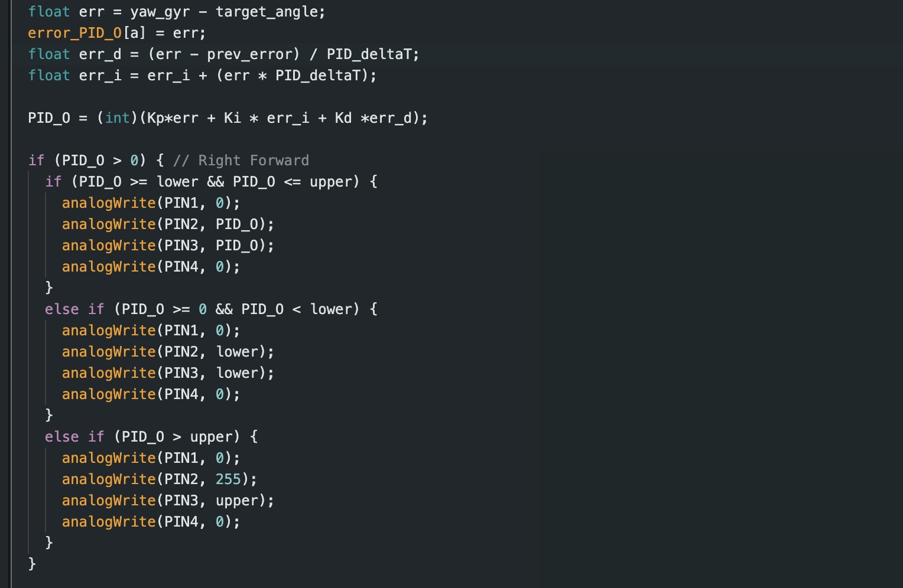
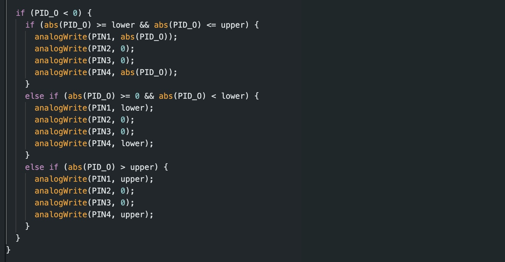

# Lab 6

## Prelab

Simlarly to Lab 5, I am implementing two cases into my ble_arduino code to initiate orientation control, and to send over the compiled data from orientation control. 

### ORIENTATION
The case ORIENTATION starts my PID controler. My PID controller has the following parameters (ORIENTATION_on, angle, Kp. Ki, Kd). The variable ORIENTATION_on (initialized as 0) controls whether the PID controller is on (1) or off (0). The input angle defines the desired angle which I base my error calcualtions on in the void loop. The final three inputs are the predetermined PID constant values. The PID controller turns off when ORIENTATION_on is manually set to 0, or when the amount of data collected exceeds the maximum array size (1000).

### SEND_ORIENTATION_DATA
The SEND_ORIENTATION_DATA case sends the relevant PID data to my computer. This includes arrays of time, yaw, P, I, D, PID, left and right motor outputs, and the angle set as the desired value. I implemented a notification handler to parse this data similarly to how I approached lab 5 with some minor modifications for the different variables. 

As mentioned previously, I implemented a hard stop for ifd the max data array size is reached, as well as a hard stop for is my robot gets disconnected. Both of these are consistent with the hard stop implemented in lab 5.

## Lab Tasks

For this task, I implemented PID control by writing code in my loop function that is continously checking the status of ORIENTATION_on which can either be set to 0 or 1 (off or on). When set to 1, by the case called ORIENTATION, the robot starts moving to its position assigned by the "angle" input.
 
### Gyroscope Implementation
In order to begin orientation control, I implemented the IMU's gyroscope into my code. To accomplish this, I tested my gyroscope by refreshing on my work from lab 2. This testing proved to me that the drift from my IMU was not negligible and lead me to use the Digital Motion Processor (DMP) for my orientation control to minimize yaw drift. To accomplish this, I followed the DMP tutorial linked on the course website. To accomplish this, I added the necessary code segments into my setup. For that, I added the following: 

### Range/Sampling Time Discussion
Referring back to lab 2, the IMU sensor has a sampling time which is relatively on par with the Artemis loop. Traditionally, the IMU has a sampling rate around 375 Hz. Given that I used the DMP function in the IMU, there is also the potential to set sampling frequency myself. I can adjust the function: 

success &= (myICM.setDMPODRrate(DMP_ODR_Reg_Quat6, 4) == ICM_20948_Stat_Ok);

By changing the value after myICM.setDMPODRrate(DMP_ODR_Reg_Quat6, I set the DMP output as slower than the Artermis so the DMP queue doesnt't overflow. 

### PID Control
To simplify my code from last time, I rewrote it to use a funciton which controls my PID control for me. When the while loop detects that ORIENTATION_on = 1, the function begins to calculate the PID control values and in turn adjusts the motor output to drive the car to the a specified angle. The function code I implemented is below: 

I found my PID values expereimentally. Based on my findings from lab 5, I began tweaking my values until I found what worked best for my robot. From a long period of trial and error, I found that the optimal set of parameters was Kp = 0.06, Ki = 0.01, and Kd = 0.08. Similarly to my code from lab 5, I implemented an upper and lower bound to ensure that my PID control is always within a proper range such tht it won't be higher than posisible and will always have enough outptut to actualu be 
