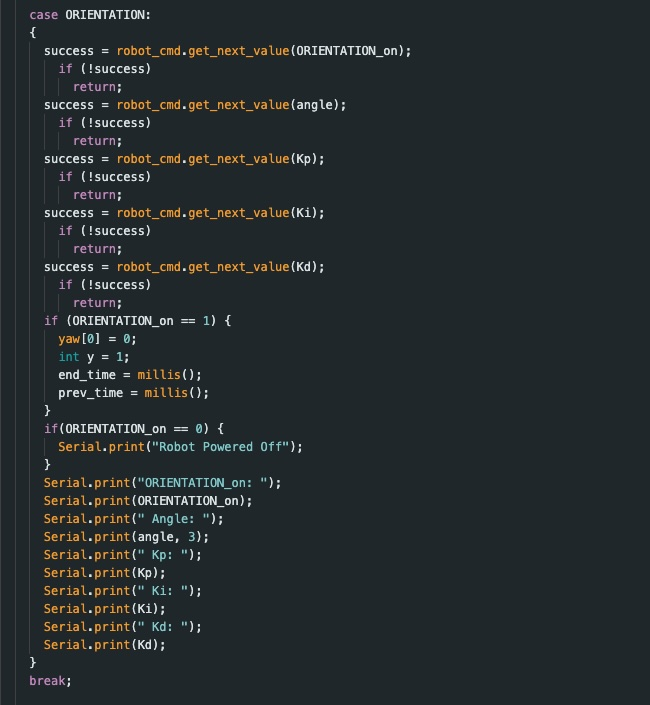
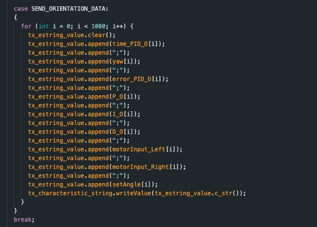
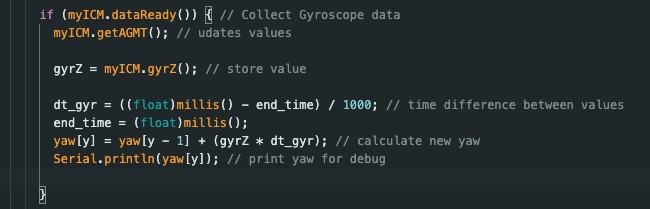

# Lab 6

## Prelab

Simlarly to Lab 5, I am implementing two cases into my ble_arduino code to initiate orientation control, and to send over the compiled data from orientation control. 

### ORIENTATION
The case ORIENTATION starts my PID controler. My PID controller has the following parameters (ORIENTATION_on, angle, Kp. Ki, Kd). The variable ORIENTATION_on (initialized as 0) controls whether the PID controller is on (1) or off (0). The input angle defines the desired angle which I base my error calcualtions on in the void loop. The final three inputs are the predetermined PID constant values. The PID controller turns off when ORIENTATION_on is manually set to 0, or when the amount of data collected exceeds the maximum array size (1000).

### SEND_ORIENTATION_DATA
The SEND_ORIENTATION_DATA case sends the relevant PID data to my computer. This includes arrays of time, yaw, P, I, D, PID, left and right motor outputs, and the angle set as the desired value. I implemented a notification handler to parse this data similarly to how I approached lab 5 with some minor modifications for the different variables. 

As mentioned previously, I implemented a hard stop for ifd the max data array size is reached, as well as a hard stop for is my robot gets disconnected. Both of these are consistent with the hard stop implemented in lab 5.

## Lab Tasks

In order to begin orientation control, I implemented the IMU's gyroscope into my code. I did this by adding code inside the while loop such that the gyroscope updates each time the while loop runs. With each loop, the value for yaw is calculated using the previous value *yaw[y - 1]*, the gyroscope's reading *gyrZ*, and the difference in time between measurements *dt_gyr*. The code I implemented can be seen below:

