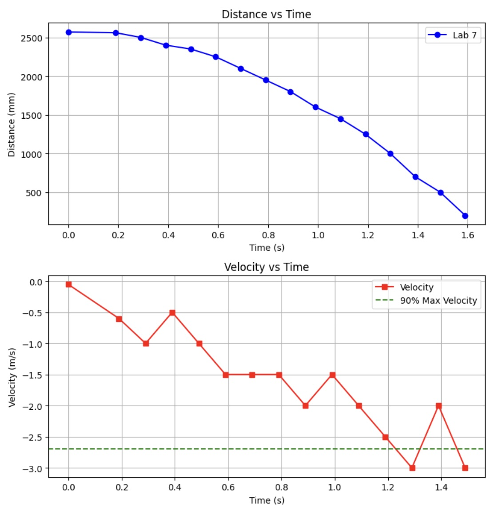
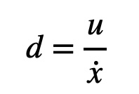
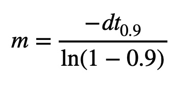
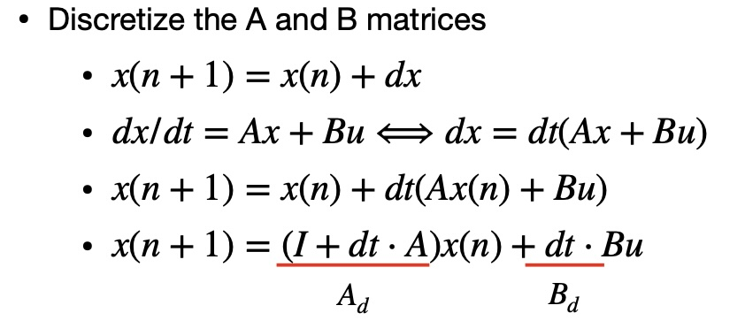
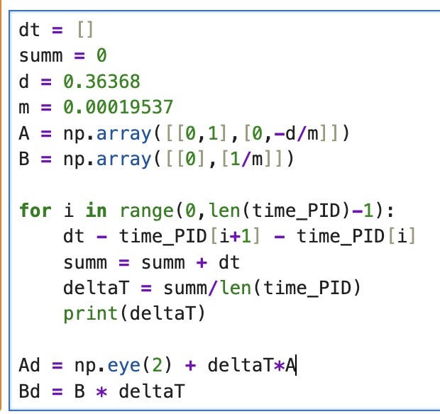
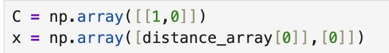
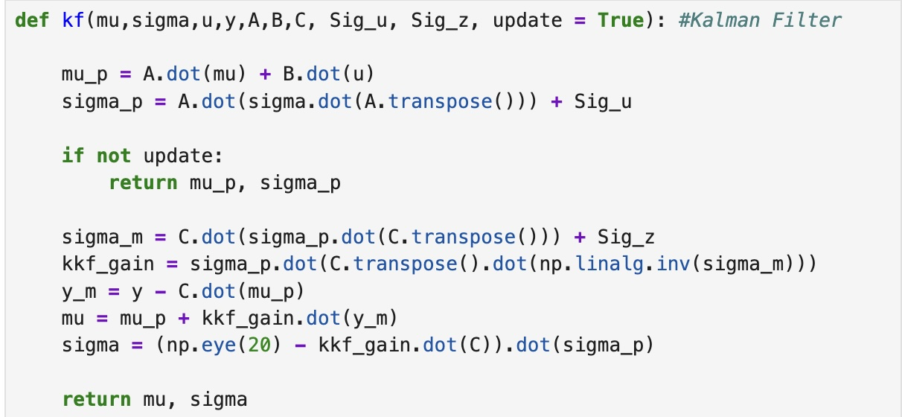

# Lab 7

## Lab Tasks

### 1. Estimate Drag and Momentum

I estimated the drag and momentume values necessary for the A and B matricies using a step response. I accomplished this by driving my robot towards a wall at a constant motor input while the ToF sensor collected distance measurements. From this data, I calculated the velocity and plotted it to find the 90% rise time. I selected my step input u(t) based on my calibration factor such that one wheel was operating at 250 PWM. This input was approximately 72% of the maximum PWM. This PWM value allowed for my robot to move as fast as possible while still moving in a straight line for long distances. 

To conduct there trials I implemented the following two cases into my code to initiate the trial and collect data.

#### MAX_SPEED
This case clears all previous data, starts my front ToF sensor, initiates storage of time data, and sets DRIVE_on to 1 (this is initialized as 0 to keep the car off until the command is called). For the MAX_SPEED case, the command inputs consist of the DRIVE_on value and the array size "max" for data collection.

#### GET_MAX_SPEED_DATA
This case transmits the collected data to my computer via Bluetooth. While designing the GET_MAX_SPEEED_DATA case, I decided that the relevant information that I needed to send to Jupyter Notebook consisted of: time, distance (mm), and PWM value. 

Collecting data over a period of two seconds, I collected the following data:

In order to calculate the drag and momentum, I used the following equations below:

  
  

From my trials using a PWM value of 180, I found that my 90% value for speed is 2.74968 m/s which occurs at approximately 1.237 seconds. Using the aforementioned equations, I got the following values for drag and momentum. 

$$ d = 1 / 2.74968 = 0.36368 $$
$$k = (-0.36368 * 1.237)/ln(0.1) = 0.19537$$

### 2. Initialize Kalman Filter (Python)

I found my A and B matricies using the following formula and my calculated values for d (drag) and m (momentum):

$$ A =
\begin{bmatrix}
0 & 1 \\
0 & -d/m
\end{bmatrix}
$$

$$ B =
\begin{bmatrix}
0 \\
1/m
\end{bmatrix}
$$

These matricies were calculated as seen below (after converting to the appropriate units)

$$ A =
\begin{bmatrix}
0 & 1 \\
0 & -1.8615
\end{bmatrix} 
$$

$$ B =
\begin{bmatrix}
0 \\
5118.4931
\end{bmatrix}
$$

Once I had my A and B matrcies, I had to discretize them. I used the following methodolgy which was presented in class to accomplish this task.

While initially, I planned to find the sampling time for the two matricies Ad and Bd, by finding the difference between timestamps, I found that this data was unreliable. As such I ended up using an average of values colleted across a loop. This in turn left me with an average sampling time of roughly 0.0872 seconds.

Below, is the calculations I completed to find the discretized Ad and Bd matricies.

$$ Ad = (I + dt * A) $$

$$ Ad =
\begin{bmatrix}
1 & 0 \\
0 & 1
\end{bmatrix} 
+(0.0872)*
\begin{bmatrix}
1 & 0 \\
0 & -1.8615
\end{bmatrix} 
$$

$$ Ad =
\begin{bmatrix}
1 & 0.0872 \\
0 & 0.8376
\end{bmatrix} 
$$

$$ Bd = (dt * B) $$

$$ B =
(0.0872) *
\begin{bmatrix}
0 \\
5118.4931
\end{bmatrix}
$$

$$ B =
\begin{bmatrix}
0 \\
446.33
\end{bmatrix}
$$

I used the following code in python to find the value for dt.

 

In order to find the C matrix, I used the following code in python

 

Lastly, I had to find the process noise and sensor noice covariance matricies. I refernced the slides from Lecture 14 to identify these equations. 

$$ \sigma_1 = \sqrt{(10mm)^2 * (1/0.0872)} = 33.864 mm$$
$$ \sigma_2 = \sqrt{(10mm/s)^2 * (1/0.0872)} = 33.864 mm$$
$$ \sigma_3 = 20 mm$$
$$ \sum_{i=1}^{u} = 
\begin{bmatrix}
(33.864)^2 & 0 \\
0 & (33.864)^2
\end{bmatrix} 
$$

$$ \sum_{i=1}^{z} = \sigma_3^2 = ((20mm)^2)$$

### 3. Implement and Test Kalman Filter in Jupyter (Python)

I implemented the following function into my python code to perform the Kalman Filter.

 

This code predicts and returns values for mu and sigma. If theres not a new ToF sensor reading, the Kalman Filter will return the predicted values. 

### References

For this lab I primarily referenced Stephen Wagner, Daria Kot, and Mikayla Lahr's labs from the past year. I also used ChatGPT for help with syntax to properly format matricies and equations in my webpage.
