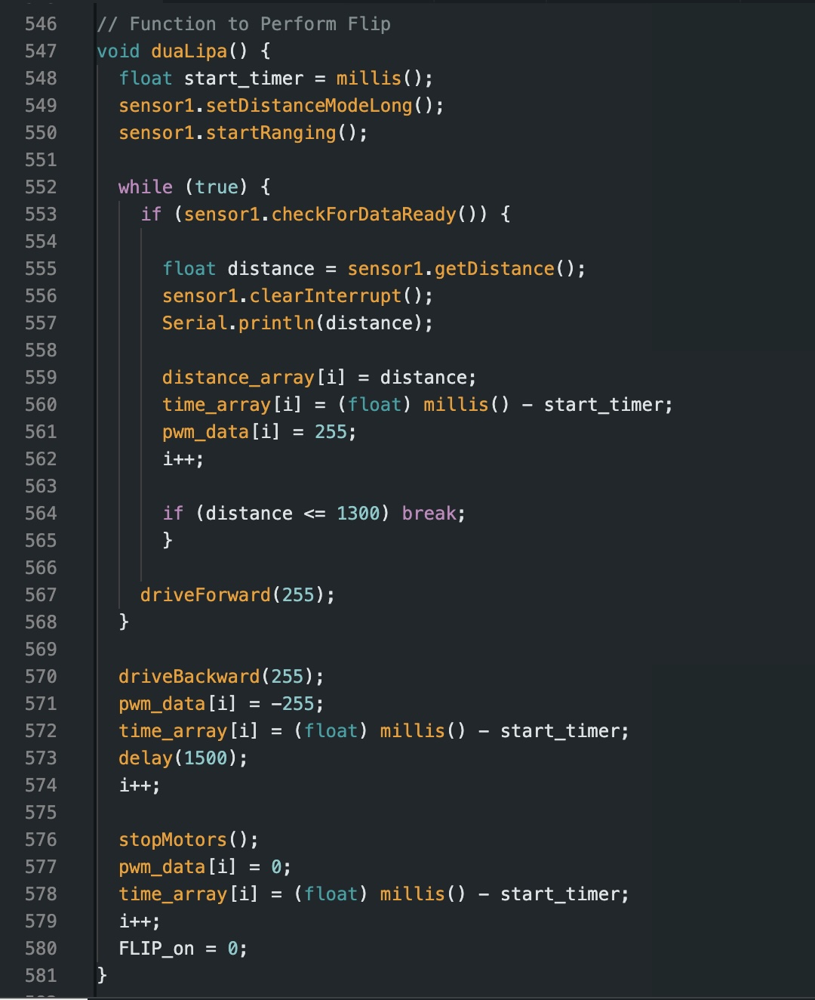
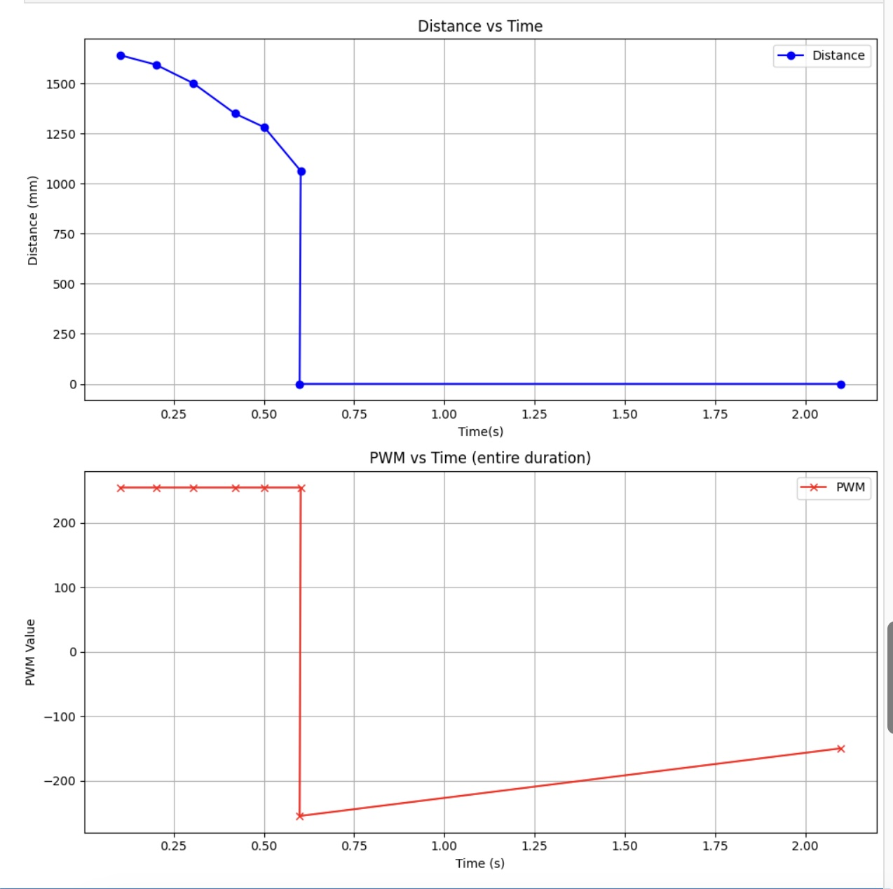

# Lab 8

## Lab Tasks

### Task A. Flip

#### Code

For this lab, I decided to attempt the flip. For this task I used open loop control to ensure my car would be able to reach its top speed, and stay there without slowing down because of my PID controller. 

To accomplish this task, I used two cases FLIP and SEND_FLIP_DATA. Similar to my past labs, FLIP used a variable "FLIP_on", which is initialized to equal 0, and sets it to 1 everytime the flip test is to be run. This in turn triggers code in my while loop which turns on the ToF sensor, and begins controlling the motors accordingly. Initially, I wrote my code such that when the ToF distance read 1 foot, it would stop the motors for a short period, and then drive backwards. I quickly noticed that this would not work and caused the car to overshoot. As such I pivoted my code so it would instead immediately switch from driving forward to backwards, creating the hard stop necessary to flip the car. I created a function called duaLipa which is called whenever the FLIP_on variable is set to 1. The relevant code snippets are below.

  
  

The function sets the robot to drive forward at full speed, and completes a hard stop by reversing once a certain distance is detected. I set this distance to be larger than outlined in the lab. This is to account for the fact that since I did this task with open loop control, I needed to overshoot the distance in order for my car to actually stop where I wanted it to. I ended up setting my distance to about 1200 mm. 

One of my biggest challenges was dealing with the physics of getting the car to flip. I ran my code multiple times without any alterations and it would not flip. As shown here, it coudln't create the necessary torque to flip the car over. 

<iframe width="355" height="631" src="https://www.youtube.com/embed/z9RJkEjdzyk" title="attempt 1 lab 8" frameborder="0" allow="accelerometer; autoplay; clipboard-write; encrypted-media; gyroscope; picture-in-picture; web-share" referrerpolicy="strict-origin-when-cross-origin" allowfullscreen></iframe>

As such, I took some measures to adjust the car's center of mass, as well as the friction between the wheels and the floor.

#### Center of Mass

To ensure a flip occurs when the car comes to a harsh stop, I had to shift the car's center of mass by adding weight to the front side where the ToF sensor is located. It took multiple iterations but I was able to get successful flips after adding 2, 9V batteries, and a rock. 

#### Friction

To help assist the back wheels in slipping, in turn making a flip more likely, I added tape to cover the back wheels so they had less traction with the ground. Additionally, I ran my tests multiple times on the regular floor as well as with a sticky mat to help with the the flip.

#### Issues During Testing

One issue I came upon was that my car would not drive in a straight line. In order to ensure my car was moving at top speed, I set both motors to 255. As a result of this, I could not use my previously identified calibration factor to make my car drive straight. When I tried using calibration values, my car was not able to drive fast enough to perform the stunt properly. For my final runthrough, I used a very small calibration factor (about 1.05) to make it such that the car drove forward relatively straight without sacrificing the necessary speed to accomplish the flip. 

#### Trials

For my data collection, I only collected ToF sensor readings as the robot was approaching the wall and once the flip was complete, I had everything else set to 0. Given the nature of the flip, the secondary distance measurements didn't provide any useful information so I figured it was best to omit them. As we can see from the plots below, the change in ToF readings to lines up with the shift in PWM inputs. 

<iframe width="374" height="665" src="https://www.youtube.com/embed/KwDDFsqCFJI" title="trial" frameborder="0" allow="accelerometer; autoplay; clipboard-write; encrypted-media; gyroscope; picture-in-picture; web-share" referrerpolicy="strict-origin-when-cross-origin" allowfullscreen></iframe>

<iframe width="374" height="665" src="https://www.youtube.com/embed/c-JyFZy0uwE" title="trial 2" frameborder="0" allow="accelerometer; autoplay; clipboard-write; encrypted-media; gyroscope; picture-in-picture; web-share" referrerpolicy="strict-origin-when-cross-origin" allowfullscreen></iframe>

While I was able to get my car to flip many times, I encountered difficulty when it came to having it navigate back to the start line. 

### Conclusion

I learned a lot during this lab about how the physical behaviors of my robot interact with code/sensors and the disparities that arise when working in tandem. For this lab I consulted the work of Nidhi Sonwalker. I also worked with Henry and Jennie. I used chatGPT to help with some python code for plotting and checking for errors.
