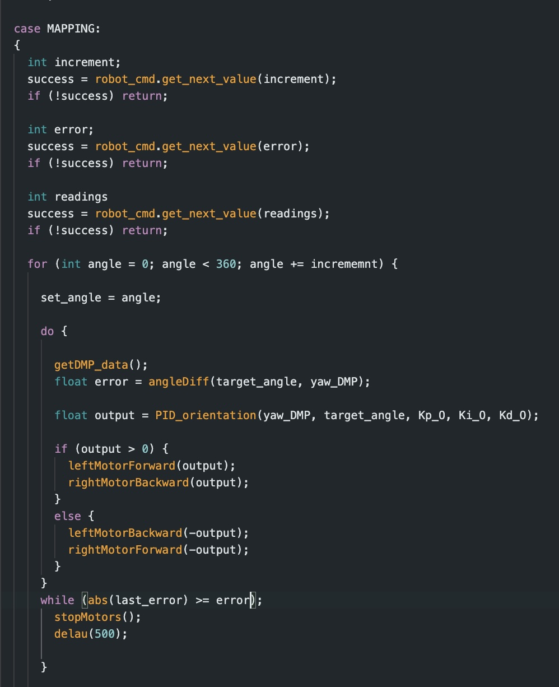

# Lab 9

### Orientation Control

To accomplish the mapping, I used orientation control. Initially, it took a lot of debugging and tweaking to refine my PID control. After many, many hours I found that the best values for my system was Kp = 1, Ki = 0.001, and Kd = 0.07. Once fully tuned, I was able to get my robot to work in 24 degree increments, taking 3 ToF sensor readings per increment. In order to run this process, I added the following case command to my code:

This case controls the robot's orientation which I then integrated ToF sensor data collection into. During my trial, I found that there was a notable amount of drift in my robots position of about 2 inches from the desired position. 

This command with ToF data collection controls the car so it turns to each angel using my PID controller until the car is within a "close enough" range which I have labeled as 4 degrees. Once stopped, the car takes 3 ToF sensors from the front sensor. This yields me 60 data points per spot. 

*INSERT VIDEO OF CODE WORKING*

### Readings Analysis

By taking measurements across four points in the room, I averaged the 4 collected data points and took that as the main reading. I then adapted the recorded angles. 

I took this data and plotted it to show the ToF distances at their corresponding angles.

*INSERT CHARTS HRE*

### TRANSFORMATION MATH

